# Banking Platform

[](https://github.com/Kalab21/banking-platform/actions/workflows/ci.yml)

A full-stack, event-driven retail banking platform: 13 Spring Boot microservices
handling accounts, payments, lending, cards, fraud and KYC behind an API gateway,
with a Next.js TypeScript console and Terraform-defined AWS infrastructure. Money
movement, amortisation and overdraft logic are covered by automated tests, and the
console reaches the platform only through the gateway — the browser never holds a
bearer token.

> **Portfolio / demonstration project.** Not a real bank and not production-certified
> financial software. It handles no real money, holds no real customer data, and makes
> no regulatory, compliance or certification claims.

## At a Glance

| | |
|---|---|
| **Backend** | 13 Spring Boot 3.3 services, Java 17, Spring Cloud Gateway + Eureka, OpenFeign |
| **Frontend** | Next.js 16 console, React 19, TypeScript, Tailwind CSS 4, Recharts |
| **Messaging** | Apache Kafka — 8 topics driving statistics, notifications and fraud scoring |
| **Data** | PostgreSQL, database-per-service, 24 Flyway migrations, `ddl-auto: validate` |
| **Cache** | Redis — read-model cache, gateway rate limiting, fraud velocity counters |
| **Security** | JWT verified at the gateway, BCrypt, TOTP two-factor at sign-in, per-resource ownership and role checks in the services |
| **Observability** | Micrometer to Prometheus and Grafana, `X-Request-Id` correlation, Brave tracing to Zipkin |
| **Testing** | 713 automated tests in CI (JUnit 5, Mockito, Testcontainers, Vitest, Playwright), plus 34 live-stack Playwright scenarios and a PowerShell full-stack suite on demand |
| **Delivery** | Docker Compose, GitHub Actions CI, CodeQL + Trivy scanning, Terraform for AWS |

**Scale:** 13 backend services plus a Next.js console, 312 Java source files,
17 REST controllers, 94 endpoints, 8 Kafka topics, 24 Flyway migrations.

---

## Screenshots

Captured automatically from the running seeded demo stack using Playwright. Every
figure shown is the seeded synthetic customer's real data, read through the
gateway from the services that own it.

| Dashboard | Accounts |
|---|---|
|  | 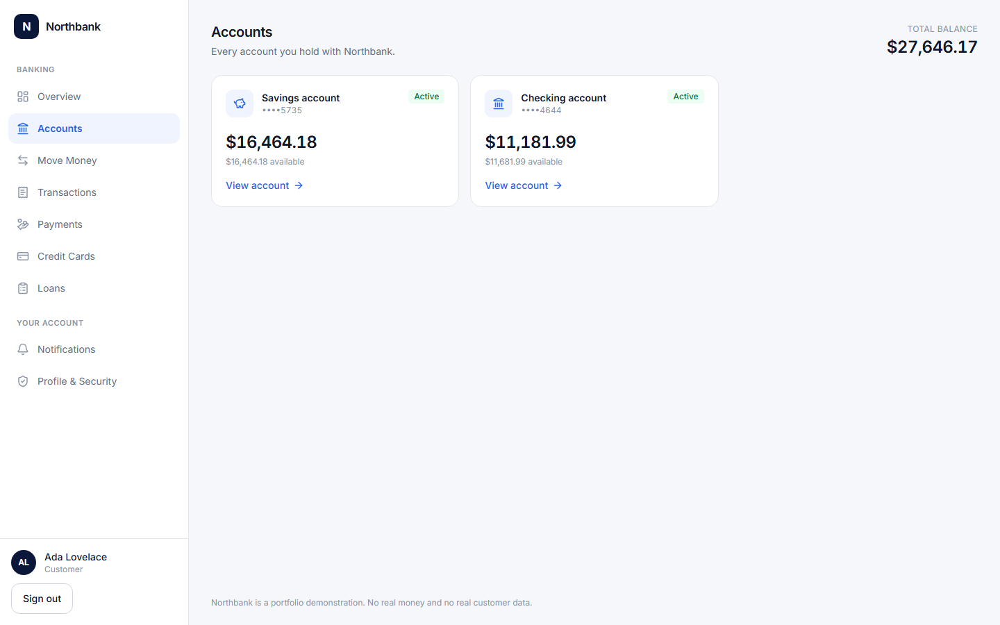 |

| Credit card | Loans |
|---|---|
| 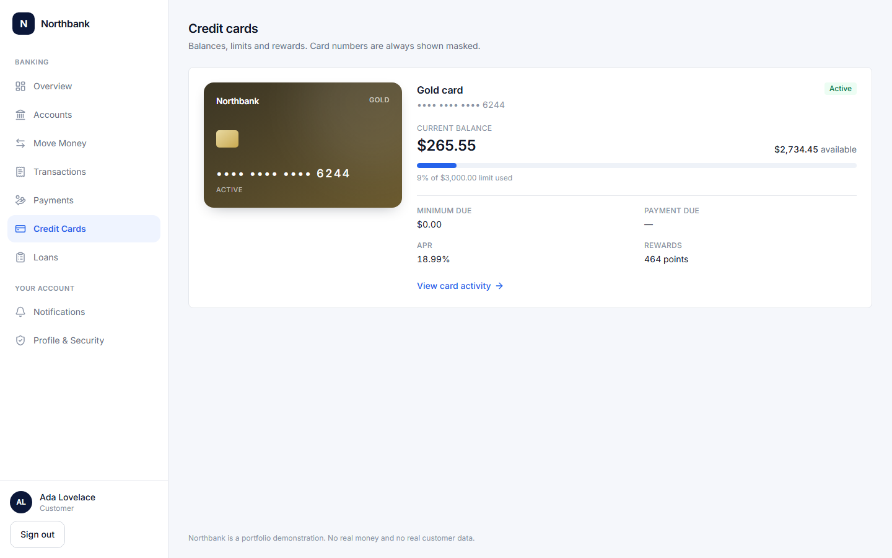 | 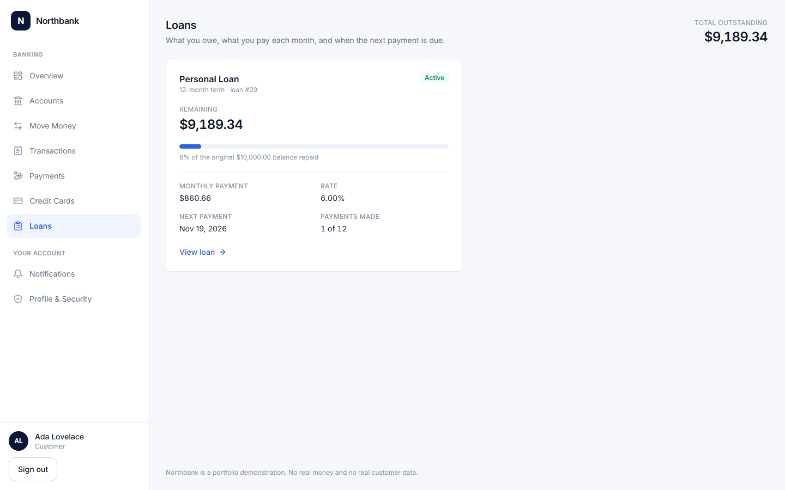 |

| Profile & security | Mobile |
|---|---|
|  | 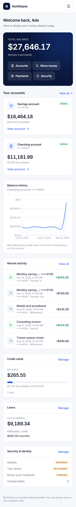 |

| Sign in | Transactions |
|---|---|
| 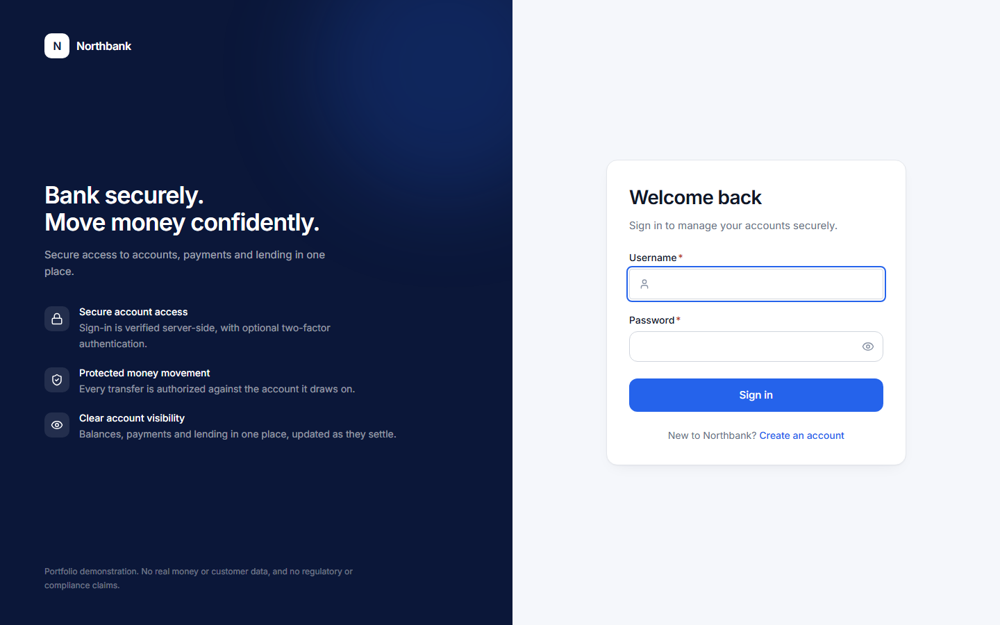 | 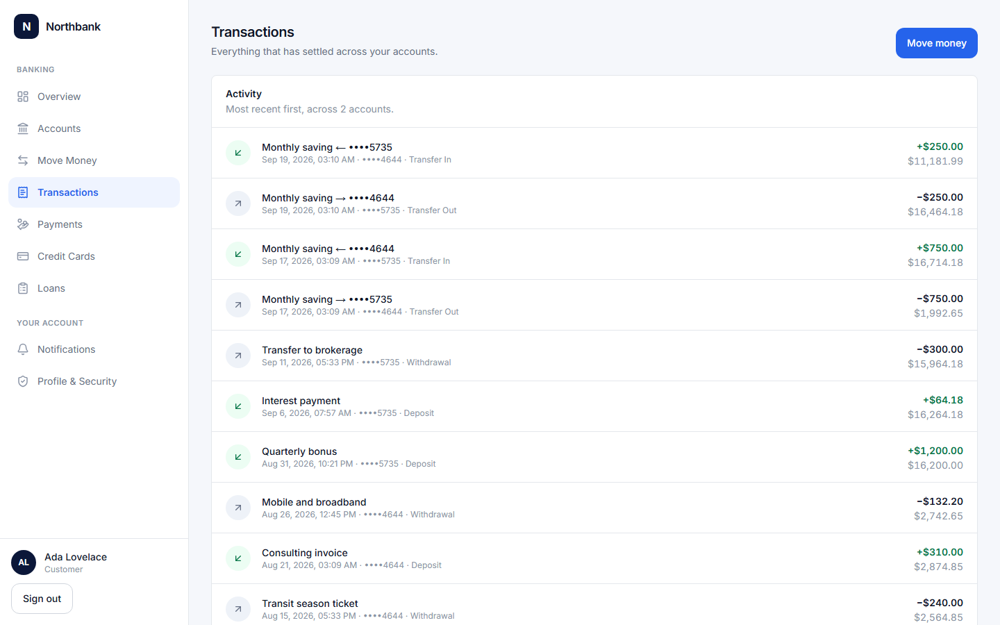 |

| Move money — review | Move money — receipt |
|---|---|
|  |  |

| Payments | Second factor |
|---|---|
| 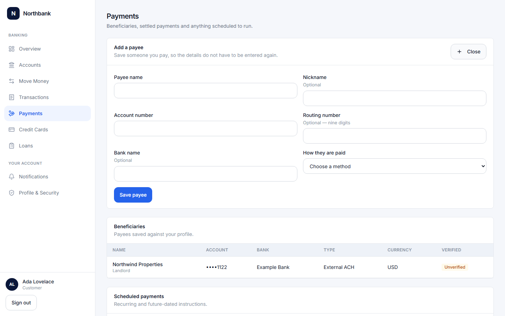 | 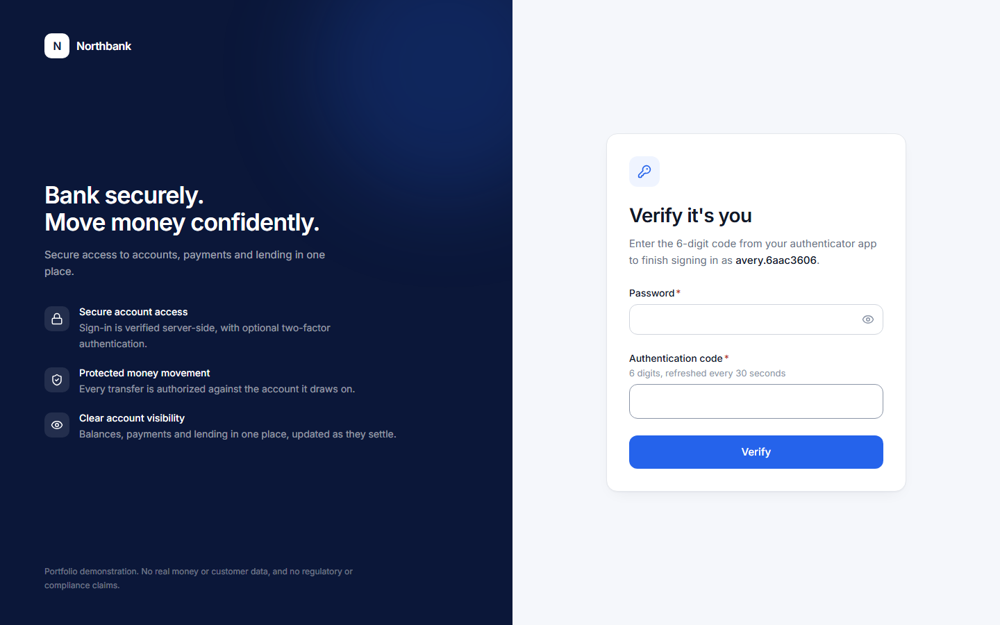 |

| Onboarding — personal details | Onboarding — review |
|---|---|
| 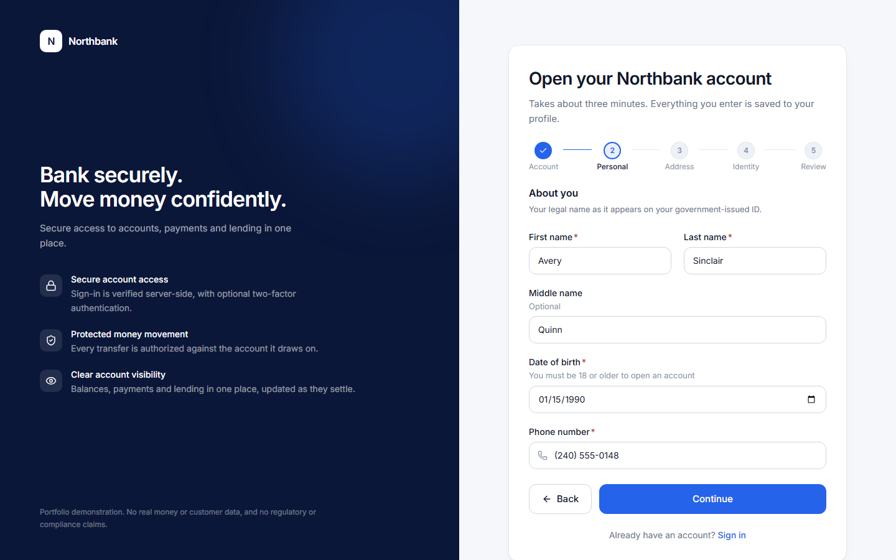 | 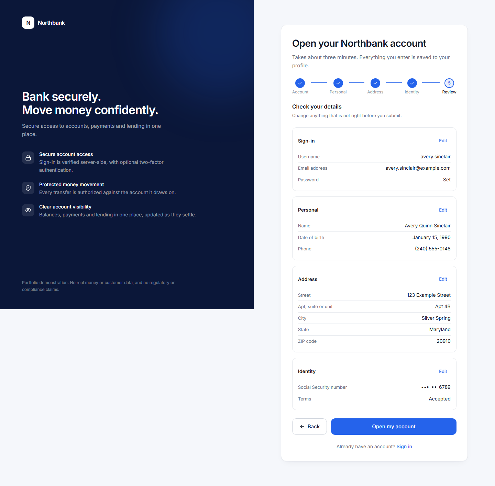 |

---

## Architecture

Independent services per business domain, each owning its own PostgreSQL database.
Asynchronous propagation over Kafka, so a transaction can update statistics, fire
notifications and trigger fraud scoring without the transaction path depending on
any of them. A single authenticated entry point validates JWTs once and forwards the
identity it derived downstream, replacing anything the client sent. Every state-changing operation writes an
`audit_log` row alongside its domain write, inside the same transaction.

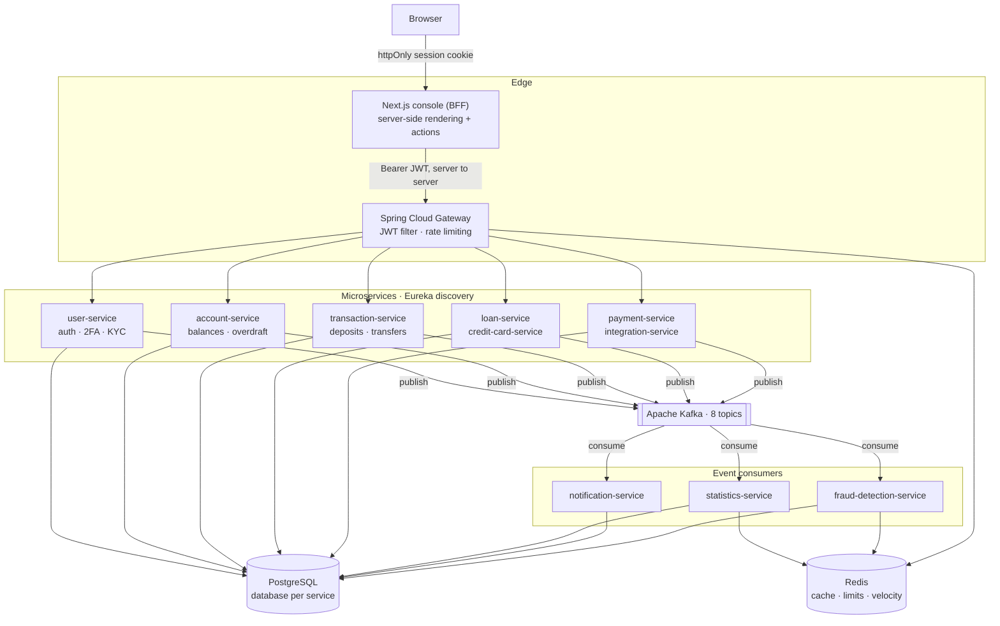

Telemetry runs alongside in its own Compose file; the application does not depend
on it.

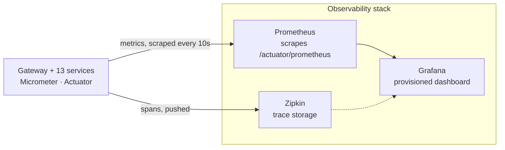

Service ports, databases and Kafka topics are listed in
[docs/DEVELOPMENT.md](docs/DEVELOPMENT.md).

### Tech stack

| Layer | Technology |
|---|---|
| Language / runtime | Java 17 |
| Framework | Spring Boot 3.3.6 |
| Cloud / distributed | Spring Cloud 2023.0.3 — Gateway, Netflix Eureka, OpenFeign |
| Security | Spring Security, JJWT 0.12.6, BCrypt, `dev.samstevens.totp` |
| Persistence | Spring Data JPA / Hibernate, PostgreSQL 16, Flyway |
| Messaging | Apache Kafka (Confluent `cp-kafka` 7.6.1) |
| Caching / counters | Redis 7 |
| Mapping | MapStruct 1.5.5, Lombok |
| API docs | springdoc-openapi 2.6.0 |
| Observability | Actuator, Micrometer, Prometheus, Grafana, Micrometer Tracing (Brave), Zipkin |
| Resilience | Resilience4j circuit breaker on `transaction-service` to `account-service` |
| Frontend | Next.js 16 (App Router), React 19, TypeScript 5, Tailwind CSS 4, Recharts 3, Zod |
| Testing | JUnit 5, Mockito, AssertJ, Testcontainers; Vitest, React Testing Library, Playwright |
| Build / CI | Maven multi-module, GitHub Actions, CodeQL, Trivy, Dependabot |
| Containers | Docker, Docker Compose |
| Cloud infrastructure | Terraform — AWS ECS Fargate, RDS, MSK, ElastiCache, ALB, WAF, CloudFront, Route 53, ECR, Secrets Manager, VPC |

---

## Key Features

Only features implemented in this repository are listed.

**Identity and onboarding** (`user-service`) — a five-step onboarding wizard
collecting sign-in details, legal name and date of birth, a US residential
address and identity details, all persisted and readable afterwards on the
profile; registration and login issuing JWTs with BCrypt-hashed passwords; TOTP
two-factor authentication (RFC 6238) with QR provisioning URI; KYC document
submission, employee/admin review and automatic status transitions; credit score
tracking updated from loan and credit-card events; `CUSTOMER` / `EMPLOYEE` /
`ADMIN` roles.

Of the Social Security number given at onboarding, only the last four digits are
kept: the server checks the format, derives those four digits and discards the
rest. No column holds the whole number and no endpoint returns one. The identity
status reads `SUBMITTED` and nothing here ever reports an identity as verified —
there is no verification provider behind this system, and passing a format check
is not verification.

**Accounts** (`account-service`) — `CHECKING` / `SAVINGS` / `BUSINESS` types;
balance debit/credit with overdraft protection (limit, overdraft balance, fee, and
automatic `OVERDRAWN` to `ACTIVE` recovery on repayment); `FROZEN` / `CLOSED`
states that reject transactions.

**Money movement** (`transaction-service`, `payment-service`) — deposit, withdrawal
and account-to-account transfer, each producing an immutable record with
`balanceAfter` and a generated reference; beneficiary management; internal and
external payments; scheduled and recurring payments driven by a polling job.

**Lending and cards** (`loan-service`, `credit-card-service`) — amortization
schedule generation, disbursement, repayment and early payoff; daily missed-payment
job; card purchases, cash advances, daily interest accrual, monthly statement
generation and rewards.

**Risk** (`fraud-detection-service`) — rules engine consuming platform events;
Redis-backed velocity counters over a configurable rolling window; raises
`FraudAlert` records and can freeze the offending account through a Feign call.

**Read models** (`statistics-service`, `notification-service`) — statistics
consumes six event topics and serves platform, per-user and daily-snapshot
aggregates cached in Redis; notifications consume seven topics and serve paginated,
markable-as-read alerts.

**External rails** (`integration-service`) — wire / ACH / SWIFT endpoints and FX
conversion. These are simulated stubs; no real banking network is contacted.

**Console** (`frontend`) — two-step sign-in challenging for a TOTP code before any
session cookie is written; customer views for dashboard, accounts, move money,
transactions, payments, loans, cards, notifications and profile; staff views for
KYC review, the application queue and fraud alerts. Pages fetch through React
Server Components and mutate through Server Actions, so the browser never holds
a bearer token.

Moving money is its own route and its own journey: choose transfer, deposit or
withdrawal, fill in the details, review exactly what is about to happen against
masked accounts, and confirm once. The id sent as the `Idempotency-Key` is
minted when the customer reaches the review step and reused for every attempt at
that same payment, so retrying a refused request is the same operation rather
than a second one. A request whose outcome the platform cannot establish — the
backend answers 504, or 500 for a transfer that debited and failed to credit —
says so, claims neither success nor failure, offers no button that would send it
again, and points at the transaction history.

What a Client Component receives is narrowed on the server. Anything handed
across that boundary is serialised into the page, so the money forms get a view
model carrying an id, a label and a masked number rather than the account
record, and the full account number never reaches the browser in the HTML, the
RSC payload or the DOM.

**Edge** (`api-gateway`) — Spring Cloud Gateway with Eureka-backed load-balanced
routing to 11 downstream services; JWT validation filter injecting `X-User-Id` /
`X-User-Role`; Redis rate limiting keyed per client IP.

---

## Security & Reliability

| Control | Implementation |
|---|---|
| Authentication | JWT bearer tokens issued by `user-service`, signed HS256 via JJWT |
| Password storage | BCrypt (`BCryptPasswordEncoder`) |
| Two-factor | TOTP (RFC 6238) enforced at sign-in: a correct password alone issues no token when 2FA is enabled |
| Edge enforcement | Gateway `GlobalFilter` validates the JWT before any route is reached, then **overwrites** any client-supplied `X-User-Id` / `X-Username` / `X-User-Role` with values derived from the token |
| Authorization | Services authorise each user-facing request against the resource's owner, not just the presence of a token. Customers reach only their own accounts, transactions, profile, KYC and statistics; employees and admins may act across customers where a workflow needs it |
| Privileged operations | Account freeze/unfreeze, overdraft limits and platform-wide statistics are staff-only. KYC review and credit-score updates keep their `@PreAuthorize` role checks |
| Internal operations | Direct balance mutation is service-to-service only, on `/internal/**`, which the gateway does not route |
| Network boundary | Only the console and the gateway are published; the business services are reachable only on the Compose network, so the gateway cannot be bypassed |
| Session model | Stateless (`SessionCreationPolicy.STATELESS`); CSRF disabled, appropriate for a token-authenticated API |
| Input validation | Jakarta Bean Validation on request DTOs |
| Error hygiene | `@RestControllerAdvice` in all 11 services with controllers; malformed bodies and bad parameter types return 400, unsupported methods 405; the catch-all logs server-side and returns a generic message |
| Card data | The full card number never crosses the API boundary — responses carry a masked value and `last4` |
| Rate limiting | Redis token bucket at the gateway, keyed per IP |
| Abuse detection | Fraud velocity rules with automatic account freeze |
| Browser session | JWT held in an httpOnly, SameSite=Lax cookie, never readable by page JavaScript |
| Secret handling | `JWT_SECRET` injected from the environment; AWS deployments use Secrets Manager |

**Session handling.** On sign-in a server action receives the token from the
gateway and writes it into an httpOnly, SameSite=Lax cookie with `Secure` in
production. Every subsequent API call is made by the Next.js server. Page
JavaScript cannot read the token, which closes the XSS token-theft path that
`localStorage` leaves open, and because the browser never calls the gateway
directly no CORS configuration was needed. Role-based navigation hides staff tools,
but authorization is enforced by the gateway and services, not the UI.

**Authorization.** The gateway authenticates the JWT and derives the caller's
identity, overwriting any `X-User-*` headers the client supplied. Each service
then authorises the request against the resource's owner: a valid token is not
permission to read or change a particular account, profile or transaction. A
`userId` in a path or request body is treated as caller input, never as proof of
ownership. Staff roles may act across customers where a workflow requires it;
account freeze, overdraft limits, platform-wide statistics, the application
queue and every fraud-alert operation are staff-only.

Direct balance mutation is service-to-service only and lives on `/internal/**`,
which the gateway does not route. The business services publish no host ports, so
the gateway cannot be bypassed by calling a service directly.

**Reliability controls.** `@Transactional` boundaries on state-changing operations
so the domain write and its audit row commit together; Flyway migrations with
`ddl-auto: validate`; Actuator liveness and readiness probes on all 13 services
with Compose healthchecks and `depends_on: service_healthy` ordering; Kafka
producers pinned to `max.block.ms: 1000` so a broker outage fails fast.

**Circuit breaker scope.** Resilience4j guards one hop: the Feign calls from
`transaction-service` to `account-service` that perform the debit and credit inside
a transfer. That path also uses a shorter timeout than the platform default (2s
connect, 5s read). No other Feign path is protected.

There is deliberately no retry, and the idempotency keys described below did not
change that. `updateBalance` is not itself idempotent, so an automatic in-process
retry after a timeout could still apply a debit twice; what a key makes safe is a
*client* repeating a request, not this service silently repeating a half-finished
downstream mutation. Business rejections are excluded from the failure rate, so
repeated insufficient-funds responses do not open the breaker. When the breaker is
open the caller receives `503` with `Retry-After`; a timeout returns `504` and
reports the outcome as unknown, since the debit may have been applied.

**Balance changes are serialised.** Every path in `account-service` that changes
an account loads it with `SELECT ... FOR UPDATE`, so the read, the
sufficiency check and the write happen under a row lock. Two simultaneous debits
of 80 against a balance of 100 leave 20 and one refusal, not -60. Pessimistic
rather than `@Version` and a retry: the same correctness with no replay of a
money-movement decision. Proved against a real PostgreSQL container, and the
tests fail if the lock is removed.

**Idempotent money movement.** `POST /api/transactions/deposit`, `/withdraw` and
`/transfer` require an `Idempotency-Key`. `transaction-service` records it under a
unique constraint with a fingerprint of the caller and the request, so a repeat of
the same request returns the original result instead of moving money again, the
same key with a different request is a `409`, and of two concurrent duplicates
exactly one executes. A failure that provably applied nothing releases the key for
a retry; a failure whose effect on the balance is unknown spends it, because
retrying would be a guess. The rules and the reasoning are in
[docs/DEVELOPMENT.md](docs/DEVELOPMENT.md).

The full model — how identity is derived, the rule table, the internal boundary
and the remaining hardening candidates — is in [docs/SECURITY.md](docs/SECURITY.md).

**Security automation.** CodeQL analyses Java and TypeScript on every push, pull
request and weekly. Trivy scans the dependency tree, Dockerfiles and Compose files,
plus the shared runtime base image. The 13 service images are not built and scanned
per push; they share one base image and one dependency tree, both already covered.
Findings report to the Security tab rather than failing the build. Dependabot opens
grouped weekly PRs for Maven, npm, GitHub Actions and Docker, with framework majors
ignored so the queue stays actionable.

---

## Observability

Each service exposes `health`, `info` and `prometheus` actuator endpoints and
nothing else. Metrics are tagged with `application`, so one Prometheus scrape
configuration and one Grafana dashboard cover all 13 services. Micrometer Tracing
(Brave) reports to Zipkin, and an `X-Request-Id` minted at the gateway propagates
across services and appears in every log line.

```bash
docker compose -f docker-compose.observability.yml up -d
```

| Endpoint | URL |
|---|---|
| Grafana dashboard | <http://localhost:3001> |
| Prometheus | <http://localhost:9090> |
| Zipkin traces | <http://localhost:9411> |

The dashboard covers target health, request rate, 5xx rate, latency quantiles,
circuit-breaker state, JVM heap, CPU and database connections, broken down by
service. Error-rate panels count 5xx responses only; expected 4xx business
rejections are excluded.

Correlation-ID rules, how to follow a trace, and current gaps are in
[docs/OBSERVABILITY.md](docs/OBSERVABILITY.md).

---

## Testing

**713 automated tests run in CI** — 439 backend (414 unit and web-slice, 25
integration against a real PostgreSQL), 205 frontend unit/component and 69
offline end-to-end. A further **34 live-stack Playwright scenarios** and a
PowerShell full-stack suite run on demand; they need all 13 services up and are
not counted in the CI total.

Counts are test cases as the runners report them, not assertions.

```bash
mvn -B --no-transfer-progress clean verify   # backend: 414 unit + 25 integration = 439
cd frontend && npm run test                  # frontend: 205 unit/component
cd frontend && npm run test:e2e              # frontend: 69 offline end-to-end
```

Coverage is deep on balances and loan arithmetic, plus card masking, the 2FA gate,
the API error contract, request correlation, the circuit-breaker policy and
resource-ownership authorization across accounts, money movement, profiles, KYC,
statistics, payees and payments, notifications, applications and fraud alerts. The integration tests run `@DataJpaTest` against a real
PostgreSQL 16 container, so entity/migration drift fails the build and the
idempotency guarantees are proved against the database that enforces them rather
than against a mock.

Suite-by-suite detail is in [docs/TESTING.md](docs/TESTING.md).

---

## Running Locally

**Prerequisites:** JDK 17+, Maven 3.8+, Docker Desktop.

```bash
git clone https://github.com/Kalab21/banking-platform.git
cd banking-platform

cp .env.example .env        # then edit the values
mvn clean package           # build all 13 service jars

docker compose up -d        # Postgres, Kafka, Redis, Eureka and 13 services
docker compose ps           # wait until healthy
```

| Endpoint | URL |
|---|---|
| **Banking console** | **<http://localhost:3000>** |
| API gateway | <http://localhost:8080> |
| Eureka dashboard | <http://localhost:8761> |
| Kafka UI | <http://localhost:8095> |

The business services publish no host ports: application traffic goes through the
gateway, which is what makes its authentication unavoidable. To reach one service
directly while developing:

```bash
docker compose -f docker-compose.yml -f docker-compose.dev-ports.yml up -d
```

Open an account at <http://localhost:3000/register> — onboarding asks for a name,
a date of birth, a US address and an identity number, so use synthetic values —
or seed a populated demo customer:

```bash
./scripts/seed-demo.sh
```

IDE-based setup, frontend-only development, API reference and build notes are in
[docs/DEVELOPMENT.md](docs/DEVELOPMENT.md).

---

## Known Limitations

These are the gaps between this project and a production ledger.

- **Cross-service transfers are not atomic.** The debit and the credit are two
  separate Feign calls with no saga, compensating transaction or outbox. A failure
  after a successful debit leaves funds withdrawn but not credited.
- **An unknown outcome is not reconciled automatically.** When a money-movement
  attempt reaches `account-service` and the answer is lost, the idempotency record
  settles as `UNKNOWN` and is logged. Nothing sweeps those rows or reverses a
  half-applied transfer; that needs the saga or outbox above.
- **Only one Feign path is protected.** `transaction-service` to `account-service`
  has a circuit breaker and timeout; the other Feign callers have neither, so a
  slow downstream service still propagates latency upstream.
- **The console is read-mostly for staff.** Employees can review KYC documents, but
  the backend has no endpoint listing all pending documents, so review is per
  customer rather than a queue. Application and fraud views are read-only.
- **The live Playwright suite does not run on every CI push.** Starting 13 services
  per push is not a sensible trade, so only the offline suite is wired into CI. The
  42 live scenarios and the PowerShell suite are automated but triggered on demand.
- **Test coverage is uneven.** Accounts, loans, cards, 2FA, transactions,
  statistics and the authorization rules are covered; `payment`, `notification`,
  `integration` and `application` services have authorization suites but no
  service-layer tests. Three services run against a real PostgreSQL through
  Testcontainers — `account-service`, `transaction-service` and `user-service` —
  and the rest are tested against mocks.
- **Money-moving writes beyond deposit, withdrawal and transfer are not in the
  console.** Payment creation, scheduled payments, loan repayment and card
  payment all exist in the backend, but none of those endpoints requires an
  `Idempotency-Key` the way `/api/transactions/*` does. A UI for them would be
  the one money path where a lost response could not be retried safely, so they
  are deliberately absent rather than half-built.
- **Authorization is enforced per request, not per field.** A staff role grants
  access to a customer's whole record rather than to specific fields, and there
  is no audit of which staff member viewed which customer.
- **Service-to-service calls are not authenticated.** The `/internal` endpoints
  rely on network isolation — no host ports and no gateway route — rather than
  mutual TLS or a service credential. That is sound for a single Compose network
  and would not be sufficient across a shared cluster.
- **External rails are simulated.** The wire / ACH / SWIFT and FX endpoints model
  request, response and persistence shape only. No banking network is contacted.

---

## Project Structure

```
banking-platform/
├── pom.xml                           # Maven parent - dependency and version management
├── docker-compose.yml                # Full stack: infrastructure + all 13 services
├── docker-compose.infra.yml          # Infrastructure only, for IDE-based development
├── docker-compose.observability.yml  # Prometheus, Grafana, Zipkin (optional)
├── Dockerfile                        # Shared JRE 17 Alpine image, non-root
├── e2e-tests.ps1                     # End-to-end suite against the running stack
├── .env.example                      # Environment template - no real credentials
│
├── frontend/                    # Next.js banking console (App Router, TypeScript)
│   ├── src/app/(auth)/          #   login, register
│   ├── src/app/(app)/           #   authenticated shell incl. /admin
│   ├── src/features/            #   server actions + client components per domain
│   ├── src/lib/api/             #   the only outbound HTTP layer (gateway only)
│   └── Dockerfile               #   standalone production image, non-root
│
├── observability/               # Telemetry configuration, provisioned on startup
│   ├── prometheus/              #   scrape config for all 13 services
│   └── grafana/                 #   datasources + the service-health dashboard
│
├── common-observability/        # Shared X-Request-Id filter and Feign interceptor
├── eureka-server/               # Service discovery
├── api-gateway/                 # Edge: routing, JWT filter, rate limiting
├── user-service/                # Auth, JWT, 2FA, KYC, credit score
├── application-service/         # Product application workflow
├── account-service/             # Accounts, balances, overdraft
├── transaction-service/         # Deposits, withdrawals, transfers
├── payment-service/             # Beneficiaries, payments, recurring
├── credit-card-service/         # Cards, interest, statements, rewards
├── loan-service/                # Amortization, disbursement, repayment
├── statistics-service/          # Kafka-fed aggregates, Redis cached
├── notification-service/        # Kafka-fed user alerts
├── fraud-detection-service/     # Rules engine, Redis velocity, freeze
├── integration-service/         # Wire/ACH/SWIFT stubs, FX
│
├── docs/                        # Observability, testing and development guides
├── docker/postgres/init-db.sql  # Creates one database per service
├── .github/workflows/           # CI, CodeQL, Trivy security scan
└── infrastructure/aws/          # Terraform: ECS, RDS, MSK, ElastiCache, ALB, WAF, Route 53
```

Each service follows the same layered package layout: `controller`, `service` plus
`impl`, `repository`, `model`, `dto`, `mapper`, `kafka`, `config`, `exception`.

---

## Usage

This repository is provided for portfolio and demonstration purposes only.
All rights reserved. No permission is granted to copy, modify, redistribute,
or reuse the source code without explicit written permission from the author.

Copyright (c) 2026 Kalabe Kebede. All rights reserved.
