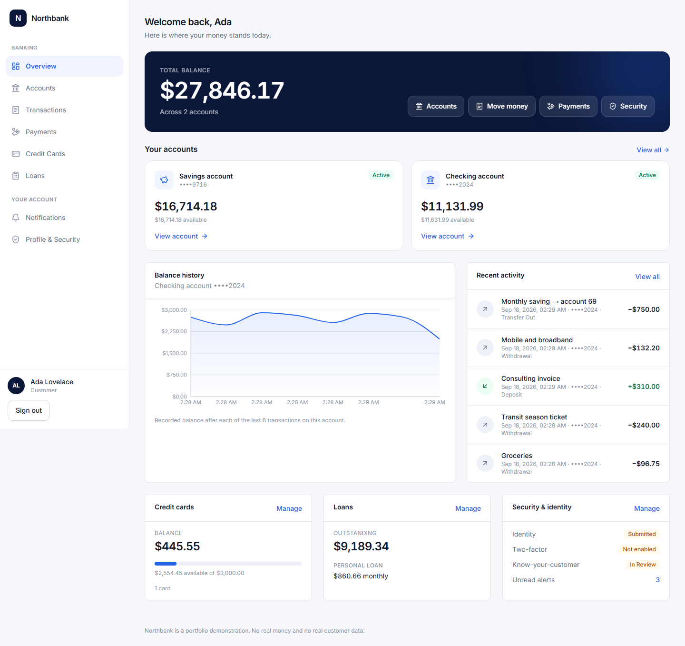
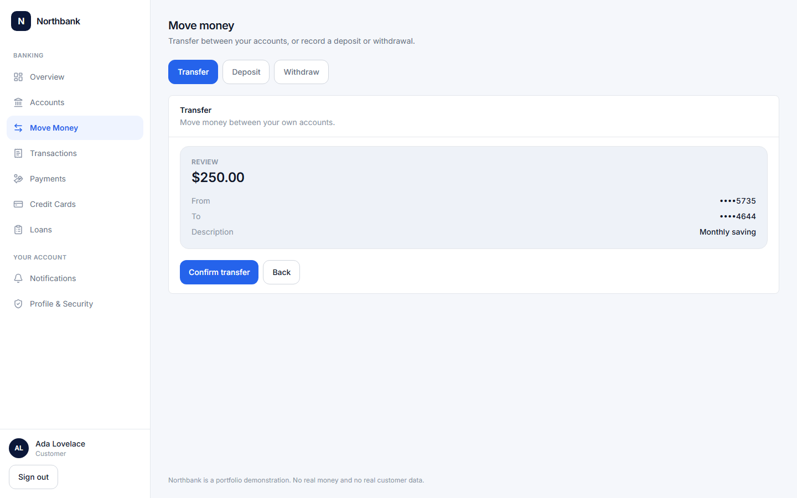
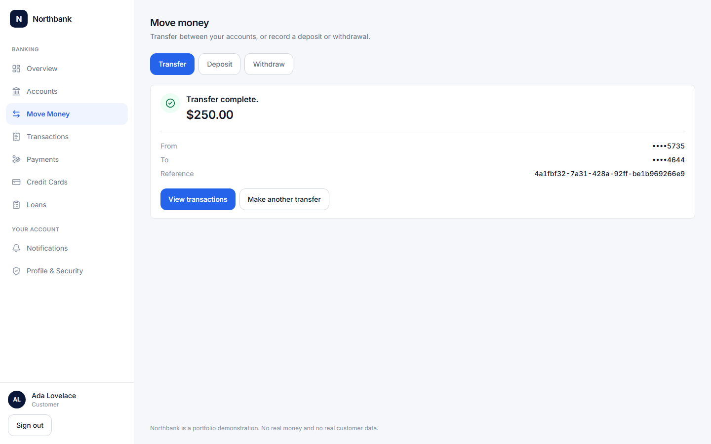
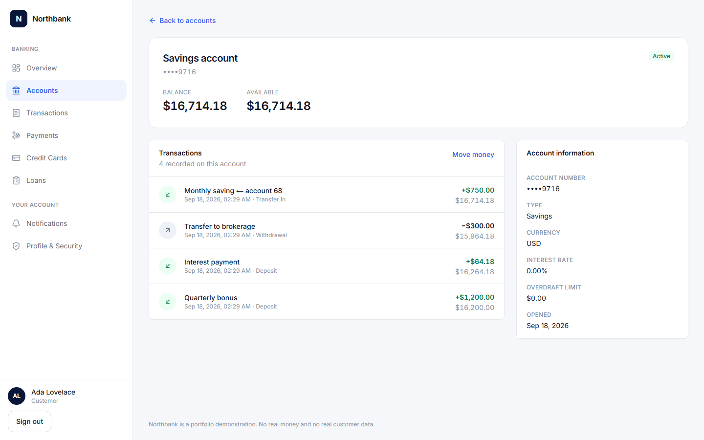
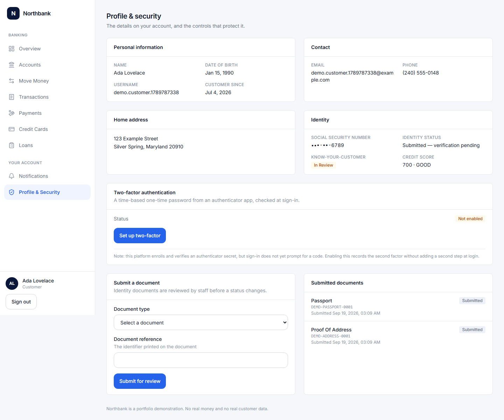
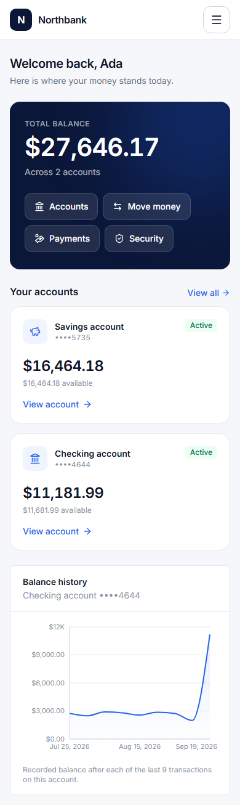
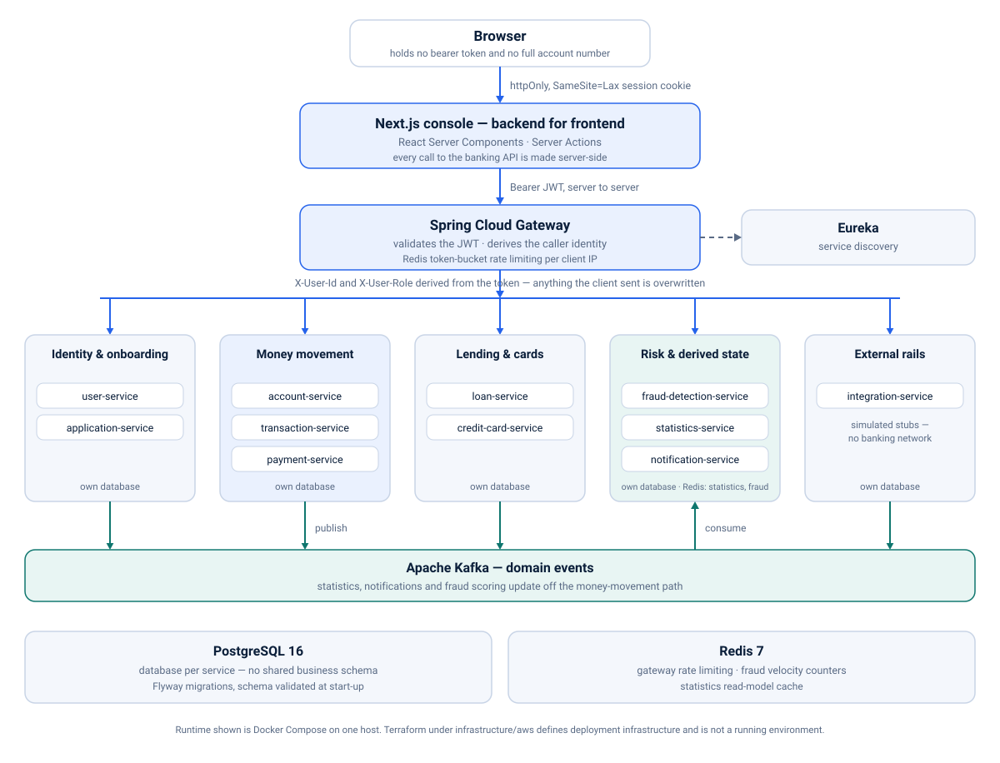

# Northbank — Event-Driven Banking Platform

A full-stack retail banking platform demonstrating secure money movement, distributed
systems, customer identity, lending, cards, fraud detection and event-driven processing
across Spring Boot services and a Next.js customer console.

[](https://github.com/Kalab21/banking-platform/actions/workflows/ci.yml)
[](https://github.com/Kalab21/banking-platform/actions/workflows/codeql.yml)
[](https://github.com/Kalab21/banking-platform/actions/workflows/security-scan.yml)

**Role:** Java Software Engineer | Full-Stack & Distributed Systems Engineering

**Core stack:** Java 17 · Spring Boot · Kafka · PostgreSQL · Redis · Next.js · React ·
TypeScript · Docker · AWS/Terraform

**Engineering proof:** 13 backend processes · 755 CI tests · idempotent money movement ·
concurrency-safe balances · resource-level authorization · responsive customer banking UX

> Portfolio demonstration using synthetic data. No real money and no production,
> regulatory or compliance claim.

---

## The product

Every figure below is the seeded synthetic customer's real data, read through the gateway
from the services that own it. The images are captured automatically by Playwright against
the running stack.



| Move money — review | Move money — receipt |
|---|---|
|  |  |

| Account detail | Profile & security |
|---|---|
|  |  |

<p align="center">
  
  <br>
  <em>The same dashboard at 390px — the full-length capture is <a href="docs/screenshots/14-dashboard-mobile.png">14-dashboard-mobile.png</a>.</em>
</p>

> **More product views:** the complete synthetic customer-flow screenshot set is in
> [`docs/screenshots/`](docs/screenshots/), and the reasoning behind the product decisions
> is in the [engineering case study](docs/PORTFOLIO_CASE_STUDY.md).

---

## Engineering highlights

**Safe money movement.** Deposit, withdrawal and transfer require an `Idempotency-Key` tied
to one logical operation. The console mints the key when the customer reaches the review
step and reuses it for every attempt at that same payment, so a retry is the same operation
rather than a second one.

**Concurrency correctness.** Every balance-changing path loads the account with
`SELECT ... FOR UPDATE`, so the read, the sufficiency check and the write happen under a row
lock. Two simultaneous debits of 80 against 100 leave 20 and one refusal, proved against a
real PostgreSQL container rather than a mock.

**Resource ownership.** Authorization is checked against the owner recorded with the
resource, never against a `userId` in the path or body. A valid token is not permission to
read a particular account, and the gateway overwrites any identity headers the client sent.

**Honest unknown outcomes.** A request whose result the platform cannot establish — a
timeout, or a transfer that debited and failed to credit — is reported as unknown. The
screen claims neither success nor failure, offers no button that would send the money
again, and points at the transaction history.

**Sensitive-data boundaries.** Full account numbers are removed before the React
Server → Client boundary, so they never reach the browser in the HTML, the RSC payload or
the DOM. Of a Social Security number only the last four digits are ever stored, and card
responses carry a masked value with `last4`.

**Event-driven derived state.** Kafka carries domain events to statistics, notifications
and fraud scoring, so none of those systems sits on the money-movement critical path.
Producers are pinned to `max.block.ms: 1000` so a broker outage fails fast instead of
blocking a balance transaction.

---

## Architecture

Independent services per business domain, each owning its own PostgreSQL database.
Asynchronous propagation over Kafka, so a transaction can update statistics, fire
notifications and trigger fraud scoring without the money path depending on any of them. A
single authenticated entry point validates JWTs once and forwards the identity it derived
downstream, replacing anything the client sent.



Several services both publish and consume: an approved application, for example, flows back
to `account-service` or `credit-card-service` to create what was approved.

**13 backend processes total:** Eureka, the API Gateway and 11 business services. The
Next.js console runs as a separate process; browser banking requests reach the platform
through this BFF and the gateway.

<details>
<summary><strong>Service inventory and ports</strong></summary>

| Process | Port | Database | Responsibility |
|---|---|---|---|
| `eureka-server` | 8761 | — | Service discovery |
| `api-gateway` | 8080 | — | Routing, JWT validation, rate limiting |
| `user-service` | 8081 | `user_db` | Auth, JWT issuing, 2FA, KYC, credit score |
| `account-service` | 8082 | `account_db` | Accounts, balances, overdraft |
| `application-service` | 8083 | `application_db` | Product application workflow |
| `transaction-service` | 8084 | `transaction_db` | Deposits, withdrawals, transfers |
| `payment-service` | 8085 | `payment_db` | Beneficiaries, payments, recurring |
| `statistics-service` | 8086 | `statistics_db` | Kafka-fed aggregates, Redis cached |
| `notification-service` | 8087 | `notification_db` | Kafka-fed customer alerts |
| `fraud-detection-service` | 8088 | `fraud_db` | Rules engine, velocity counters, freeze |
| `credit-card-service` | 8089 | `creditcard_db` | Cards, interest, statements, rewards |
| `loan-service` | 8090 | `loan_db` | Amortization, disbursement, repayment |
| `integration-service` | 8091 | `integration_db` | Wire / ACH / SWIFT stubs, FX |

Ports, databases and Kafka topics are also listed in
[docs/DEVELOPMENT.md](docs/DEVELOPMENT.md).

</details>

---

## At a glance

| | |
|---|---|
| **Backend** | Java 17, Spring Boot 3.3.6, Spring Cloud Gateway + Eureka, OpenFeign |
| **Frontend** | Next.js 16, React 19, TypeScript 5, Tailwind CSS 4, Recharts |
| **Messaging** | Apache Kafka — domain events for statistics, notifications, fraud signals and application-driven issuance workflows |
| **Data** | PostgreSQL 16, database per service, Flyway migrations, `ddl-auto: validate`; Redis 7 for rate limits, velocity counters and read-model cache |
| **Security** | JWT verified at the gateway, BCrypt, TOTP two-factor at sign-in, per-resource ownership and role checks in the services |
| **Observability** | Micrometer to Prometheus and Grafana, Brave tracing to Zipkin, `X-Request-Id` correlation |
| **Testing** | 755 tests in CI (JUnit 5, Mockito, Testcontainers, Vitest, Playwright), plus 34 live-stack Playwright scenarios and a PowerShell full-stack suite on demand |
| **Delivery** | Docker Compose, GitHub Actions CI, CodeQL + Trivy scanning, Terraform for AWS |

<details>
<summary><strong>Full technology stack with versions</strong></summary>

| Layer | Technology |
|---|---|
| Language / runtime | Java 17 |
| Framework | Spring Boot 3.3.6 |
| Cloud / distributed | Spring Cloud 2023.0.3 — Gateway, Netflix Eureka, OpenFeign |
| Security | Spring Security, JJWT 0.12.6, BCrypt, `dev.samstevens.totp` |
| Persistence | Spring Data JPA / Hibernate, PostgreSQL 16, Flyway |
| Messaging | Apache Kafka (Confluent `cp-kafka` 7.6.1) |
| Caching / counters | Redis 7 |
| Mapping | MapStruct 1.5.5, Lombok |
| API docs | springdoc-openapi 2.6.0 |
| Observability | Actuator, Micrometer, Prometheus, Grafana, Micrometer Tracing (Brave), Zipkin |
| Resilience | Resilience4j circuit breaker on `transaction-service` → `account-service` |
| Frontend | Next.js 16 (App Router), React 19, TypeScript 5, Tailwind CSS 4, Recharts 3, Zod |
| Testing | JUnit 5, Mockito, AssertJ, Testcontainers; Vitest, React Testing Library, Playwright |
| Build / CI | Maven multi-module, GitHub Actions, CodeQL, Trivy, Dependabot |
| Containers | Docker, Docker Compose |
| Cloud infrastructure | Terraform — AWS ECS Fargate, RDS, MSK, ElastiCache, ALB, WAF, CloudFront, Route 53, ECR, Secrets Manager, VPC |

</details>

---

## Product capabilities

Only capabilities implemented in this repository are listed.

**Identity and onboarding** (`user-service`) — a five-step onboarding wizard collecting
sign-in details, legal name and date of birth, a US residential address and identity
details; registration and login issuing JWTs with BCrypt-hashed passwords; TOTP two-factor
authentication (RFC 6238) enforced at sign-in; KYC document submission with employee review;
credit score tracking updated from loan and card events; `CUSTOMER` / `EMPLOYEE` / `ADMIN`
roles.

**Accounts and money movement** (`account-service`, `transaction-service`,
`payment-service`) — checking, savings and business accounts with overdraft protection and
`FROZEN` / `CLOSED` states; deposit, withdrawal and transfer, each producing an immutable
record with `balanceAfter` and a generated reference; beneficiaries, internal and external
payments, and scheduled payments driven by a polling job.

**Lending and cards** (`loan-service`, `credit-card-service`) — amortization schedule
generation, disbursement, repayment and early payoff; card purchases, cash advances, daily
interest accrual, monthly statements and rewards.

**Risk and derived state** (`fraud-detection-service`, `statistics-service`,
`notification-service`) — a rules engine with Redis-backed velocity counters that can freeze
an account; platform, per-user and daily-snapshot aggregates; paginated customer alerts.
All three are fed by Kafka.

<details>
<summary><strong>More detail on the console, identity handling and the edge</strong></summary>

**Console** (`frontend`) — two-step sign-in challenging for a TOTP code before any session
cookie is written; customer views for dashboard, accounts, move money, transactions,
payments, loans, cards, notifications and profile; staff views for KYC review, the
application queue and fraud alerts. Pages fetch through React Server Components and mutate
through Server Actions, so the browser never holds a bearer token.

Moving money is its own route and its own journey: choose transfer, deposit or withdrawal,
fill in the details, review exactly what is about to happen against masked accounts, and
confirm once. The id sent as the `Idempotency-Key` is minted when the customer reaches the
review step and reused for every attempt at that same payment. A request whose outcome the
platform cannot establish says so, claims neither success nor failure, offers no button that
would send it again, and points at the transaction history.

What a Client Component receives is narrowed on the server. Anything handed across that
boundary is serialized into the page, so the money forms get a view model carrying an id, a
label and a masked number rather than the account record.

**Identity numbers.** Of the Social Security number given at onboarding, only the last four
digits are kept: the server checks the format, derives those four digits and discards the
rest. No column holds the whole number and no endpoint returns one. The identity status
reads `SUBMITTED`, and nothing here ever reports an identity as verified — there is no
verification provider behind this system, and passing a format check is not verification.

**External rails** (`integration-service`) — wire / ACH / SWIFT endpoints and FX conversion,
modeling request, response and persistence shape only. No banking network is contacted.

**Edge** (`api-gateway`) — Spring Cloud Gateway with Eureka-backed load-balanced routing to
11 downstream services; a JWT validation filter injecting `X-User-Id` / `X-User-Role`; Redis
rate limiting keyed per client IP.

</details>

---

## Security & reliability

| Control | Implementation |
|---|---|
| Authentication | JWT bearer tokens issued by `user-service`, signed HS256 |
| Browser session | JWT held in an httpOnly, SameSite=Lax cookie; page JavaScript cannot read it |
| Two-factor | TOTP (RFC 6238) enforced at sign-in: with 2FA enabled, a correct password alone issues no token |
| Edge enforcement | The gateway validates the JWT before any route is reached, then overwrites any client-supplied `X-User-Id` / `X-Username` / `X-User-Role` |
| Authorization | Each service authorizes against the resource's recorded owner; staff roles may act across customers only where a workflow requires it |
| Internal operations | Direct balance mutation is service-to-service only, on `/internal/**`, which the gateway does not route |
| Balance integrity | `SELECT ... FOR UPDATE` on every balance change; no lost update under concurrent debits |
| Idempotency | `Idempotency-Key` on money movement, with a unique constraint and a request fingerprint |
| Data minimization | The full card number never crosses the API boundary; only the last four digits of an identity number are stored; account numbers stop at the server |
| Automation | CodeQL on Java and TypeScript, Trivy on dependencies, Dockerfiles and the runtime base image, Dependabot weekly |

**Circuit breaker scope.** Resilience4j guards one hop — the Feign calls from
`transaction-service` to `account-service` that perform the debit and credit inside a
transfer, with a shorter timeout than the platform default. There is deliberately no retry:
`updateBalance` is not itself idempotent, so an automatic retry after a timeout could apply
a debit twice. What an idempotency key makes safe is a *client* repeating a request, not a
service silently repeating a half-finished downstream mutation. When the breaker is open the
caller receives `503`; a timeout returns `504` and the outcome is reported as unknown.

The full model — how identity is derived, the rule table, the internal boundary and the
remaining hardening candidates, including findings this project has not fixed — is in
[docs/SECURITY.md](docs/SECURITY.md).

---

## Verification

| Evidence | Result |
|---|---:|
| Backend — unit, web-slice and Testcontainers integration | 473 |
| Frontend unit and component | 213 |
| Offline Playwright (production build, no backend) | 69 |
| **CI total** | **755** |
| Live Playwright against the running stack — on demand | 34 scenarios |
| PowerShell full-stack suite — on demand | 63 / 63 |

The backend total is 440 unit and web-slice tests plus 33 integration tests that run
`@DataJpaTest` against a real PostgreSQL 16 container, so entity and migration drift fails
the build and the concurrency and idempotency guarantees are proved against the database
that enforces them. The live Playwright and PowerShell suites need all 13 backend processes
running, so they are triggered on demand rather than on every push, and are not counted in
the CI total. Counts are test cases as the runners report them, not assertions.

```bash
mvn -B --no-transfer-progress clean verify   # backend: 440 unit + 33 integration = 473
cd frontend && npm run test                  # frontend: 213 unit/component
cd frontend && npm run test:e2e              # frontend: 69 offline end-to-end
```

Suite-by-suite detail is in [docs/TESTING.md](docs/TESTING.md).

---

## Observability

**Micrometer → Prometheus → Grafana, with Brave tracing to Zipkin and `X-Request-Id`
correlation across service boundaries.** Each service exposes `health`, `info` and
`prometheus` and nothing else; metrics are tagged with `application`, so one scrape
configuration and one dashboard cover every process. Telemetry runs in its own Compose file
and the application does not depend on it.

```bash
docker compose -f docker-compose.observability.yml up -d
```

Grafana <http://localhost:3001> · Prometheus <http://localhost:9090> · Zipkin
<http://localhost:9411>

[Observability details](docs/OBSERVABILITY.md)

---

## Run locally

**Prerequisites:** JDK 17+, Maven 3.8+, Docker Desktop.

```bash
git clone https://github.com/Kalab21/banking-platform.git
cd banking-platform

cp .env.example .env     # then edit the values
mvn clean package        # build the service jars
docker compose up -d     # Postgres, Kafka, Redis, Eureka, the gateway and 11 services
./scripts/seed-demo.sh   # optional: a populated synthetic customer, credentials printed
```

| Endpoint | URL |
|---|---|
| **Banking console** | **<http://localhost:3000>** |
| API gateway | <http://localhost:8080> |
| Eureka dashboard | <http://localhost:8761> |
| Kafka UI | <http://localhost:8095> |

The business services publish no host ports: application traffic goes through the gateway,
which is what makes its authentication unavoidable. IDE-based setup, frontend-only
development, the API reference and build notes are in
[docs/DEVELOPMENT.md](docs/DEVELOPMENT.md).

---

## Engineering tradeoffs

### Distributed transfer consistency

Account-to-account transfers cross a service boundary rather than using a distributed
transaction. Partial or uncertain outcomes are surfaced as unknown and require
reconciliation rather than an unsafe automatic retry. A complete production-oriented
solution would require a deliberate saga, outbox and compensation design.

### Service-to-service identity

Internal calls rely on isolation inside the local Compose network. A shared production
cluster would require workload identity, signed service credentials or mTLS rather than
network placement alone.

### External financial rails

Wire, ACH and SWIFT integrations are simulated adapters. The project demonstrates
contracts, persistence and failure handling without connecting to real financial networks
or moving real money.

> Additional limitations and future-hardening items are documented in the
> [engineering case study](docs/PORTFOLIO_CASE_STUDY.md).

---

## Engineering documentation

- [Architecture & local development](docs/DEVELOPMENT.md)
- [Security model](docs/SECURITY.md)
- [Testing strategy](docs/TESTING.md)
- [Observability](docs/OBSERVABILITY.md)
- [Portfolio engineering case study](docs/PORTFOLIO_CASE_STUDY.md)
- [Full screenshot gallery](docs/screenshots/)

<details>
<summary><strong>Repository structure</strong></summary>

```
banking-platform/
├── pom.xml                           # Maven parent - dependency and version management
├── docker-compose.yml                # Full stack: infrastructure + all 13 backend processes
├── docker-compose.infra.yml          # Infrastructure only, for IDE-based development
├── docker-compose.observability.yml  # Prometheus, Grafana, Zipkin (optional)
├── Dockerfile                        # Shared JRE 17 Alpine image, non-root
├── e2e-tests.ps1                     # End-to-end suite against the running stack
├── .env.example                      # Environment template - no real credentials
│
├── frontend/                    # Next.js banking console (App Router, TypeScript)
│   ├── src/app/(auth)/          #   login, register
│   ├── src/app/(app)/           #   authenticated shell incl. /admin
│   ├── src/features/            #   server actions + client components per domain
│   ├── src/lib/api/             #   the only outbound HTTP layer (gateway only)
│   └── Dockerfile               #   standalone production image, non-root
│
├── observability/               # Telemetry configuration, provisioned on startup
├── common-observability/        # Shared X-Request-Id filter and Feign interceptor
├── common-security/             # Caller identity, access guard, denial handling
├── eureka-server/               # Service discovery
├── api-gateway/                 # Edge: routing, JWT filter, rate limiting
├── user-service/                # Auth, JWT, 2FA, KYC, credit score
├── application-service/         # Product application workflow
├── account-service/             # Accounts, balances, overdraft
├── transaction-service/         # Deposits, withdrawals, transfers
├── payment-service/             # Beneficiaries, payments, recurring
├── credit-card-service/         # Cards, interest, statements, rewards
├── loan-service/                # Amortization, disbursement, repayment
├── statistics-service/          # Kafka-fed aggregates, Redis cached
├── notification-service/        # Kafka-fed customer alerts
├── fraud-detection-service/     # Rules engine, Redis velocity, freeze
├── integration-service/         # Wire/ACH/SWIFT stubs, FX
│
├── docs/                        # Architecture, security, testing and case-study documents
├── docker/postgres/init-db.sql  # Creates one database per service
├── .github/workflows/           # CI, CodeQL, security scan
└── infrastructure/aws/          # Terraform: ECS, RDS, MSK, ElastiCache, ALB, WAF, Route 53
```

Each service follows the same layered package layout: `controller`, `service` plus `impl`,
`repository`, `model`, `dto`, `mapper`, `kafka`, `config`, `exception`.

</details>

---

## Usage

This repository is provided for portfolio and demonstration purposes only. All rights
reserved. No permission is granted to copy, modify, redistribute, or reuse the source code
without explicit written permission from the author.

Copyright (c) 2026 Kalabe Kebede. All rights reserved.
