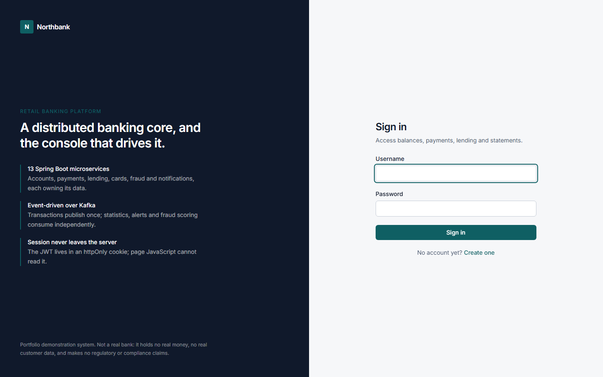
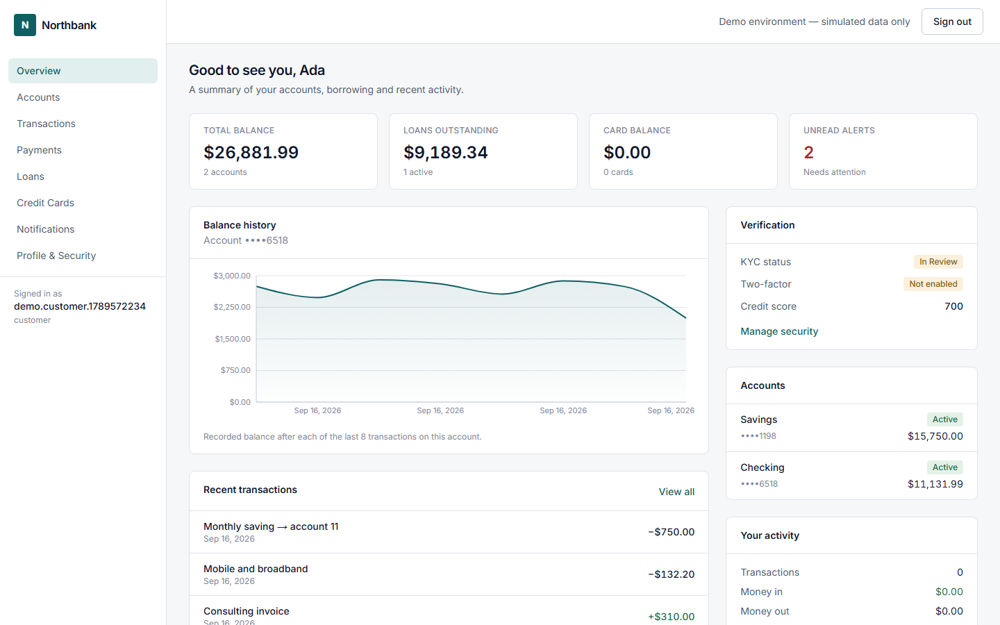
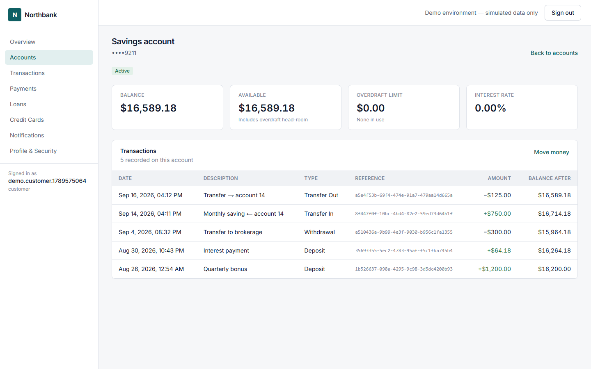
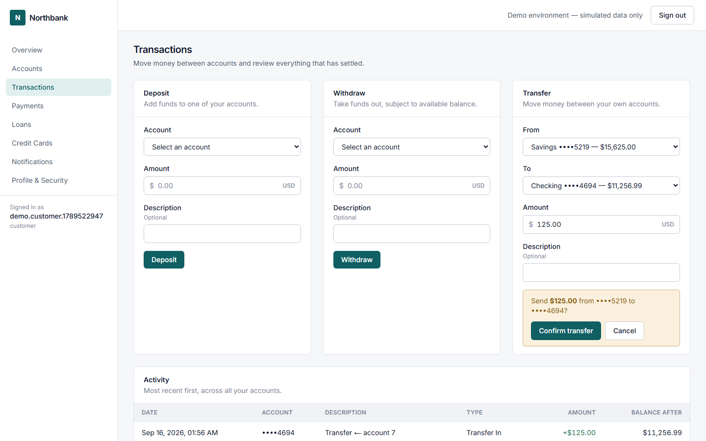
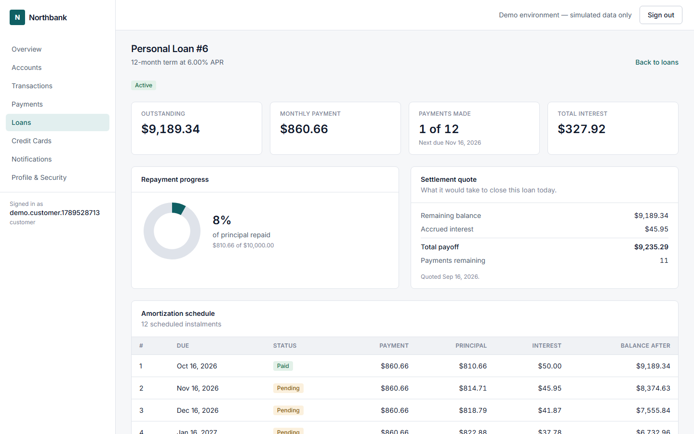
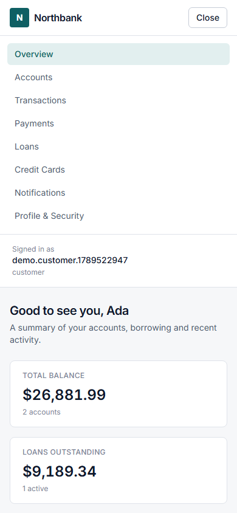
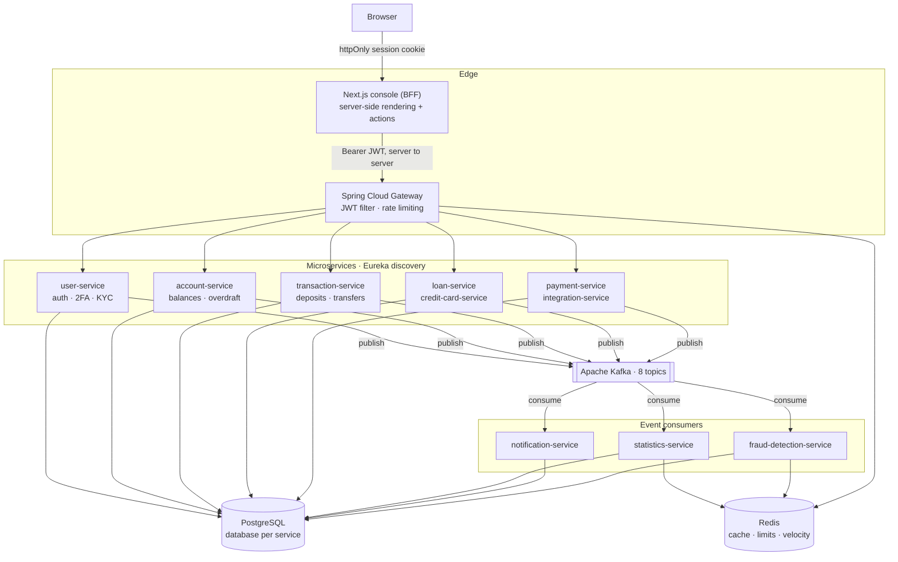
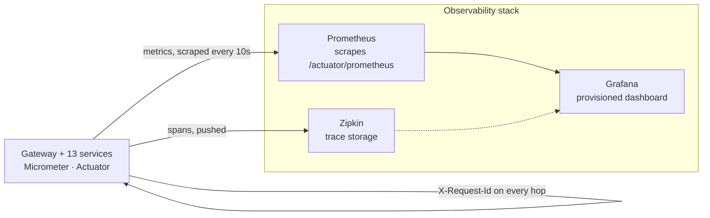
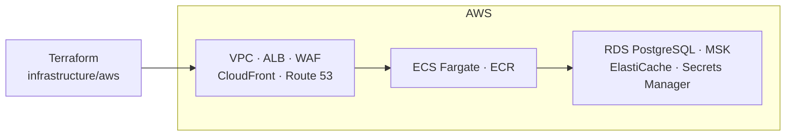
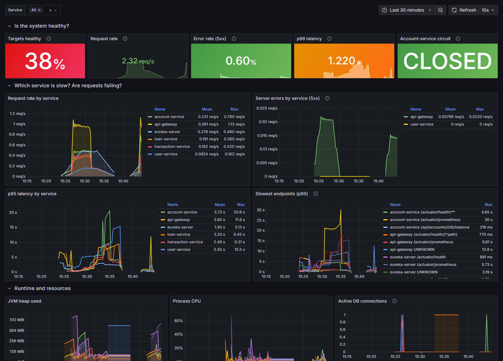

# Banking Platform

[](https://github.com/Kalab21/banking-platform/actions/workflows/ci.yml)

A full-stack, event-driven retail banking platform: **13 Spring Boot microservices** handling
accounts, payments, lending, cards, fraud and KYC behind an API gateway, with a **Next.js
TypeScript console** on the front and **Terraform-defined AWS infrastructure** underneath. Money
movement, amortisation and overdraft logic are covered by automated tests, and the console reaches
the platform only through the gateway — the browser never holds a bearer token.

> **Portfolio / demonstration project.** Not a real bank and not production-certified financial
> software. It handles no real money, holds no real customer data, and makes no regulatory,
> compliance or certification claims.

### At a glance

| | |
|---|---|
| **Backend** | 13 Spring Boot 3.3 services, Java 17, Spring Cloud Gateway + Eureka, OpenFeign |
| **Frontend** | Next.js 16 console, React 19, TypeScript, Tailwind CSS 4, Recharts |
| **Messaging** | Apache Kafka — 8 topics driving statistics, notifications and fraud scoring |
| **Data** | PostgreSQL, database-per-service, 24 Flyway migrations, `ddl-auto: validate` |
| **Cache** | Redis — read-model cache, gateway rate limiting, fraud velocity counters |
| **Security** | JWT verified at the gateway, BCrypt, TOTP two-factor at sign-in, role-based access |
| **Testing** | 187 automated tests in CI (JUnit 5, Mockito, Testcontainers, Vitest, Playwright), plus 9 live-stack Playwright scenarios on demand |
| **Observability** | Micrometer metrics → Prometheus → Grafana, `X-Request-Id` correlation, Brave tracing → Zipkin |
| **Delivery** | Docker Compose for the full stack, GitHub Actions CI, CodeQL + Trivy scanning, Terraform for AWS |

---

## Screenshots

Captured from the running application with seeded demo data — no mockups.

| Sign in | Dashboard |
|---|---|
|  |  |

| Account & transactions | Transfer confirmation |
|---|---|
|  |  |

| Loan detail & amortization | Mobile |
|---|---|
|  |  |

Screenshots are captured by the Playwright live suite (`npm run screenshots`), so they cannot
drift from the running application.

---

## Overview

Retail banking back ends are rarely one application. They are many bounded domains — identity, ledgers, cards, lending, risk — that must stay consistent, auditable and available while evolving independently.

This project models that problem end to end:

- **Independent services per business domain**, each owning its own PostgreSQL database (database-per-service), so no service reaches into another's tables.
- **Asynchronous, event-driven propagation** over Kafka, so a transaction can update statistics, fire notifications and trigger fraud scoring without the transaction path depending on any of them.
- **A single authenticated entry point** — an API gateway that validates JWTs once and forwards trusted identity headers downstream.
- **An auditable trail** — every state-changing operation writes an `audit_log` row alongside its domain write, inside the same transaction.

**By the numbers:** 13 backend services plus a Next.js console, 291 Java source files, 25 REST controllers, 93 endpoints, 8 Kafka topics, 24 Flyway migrations, 18 frontend routes, 187 automated tests in CI.

---

## Key Features

Only features actually implemented in this repository are listed.

### Identity and onboarding — `user-service`

- Registration and login issuing JWTs, with BCrypt-hashed passwords.
- **TOTP two-factor authentication** (RFC 6238) with QR provisioning URI.
- **KYC workflow** — document submission, employee/admin review, automatic `kyc_status` transitions.
- **Credit score tracking** with full history, updated reactively from loan and credit-card Kafka events.
- Role-based accounts: `CUSTOMER`, `EMPLOYEE`, `ADMIN`.

### Accounts — `account-service`

- `CHECKING` / `SAVINGS` / `BUSINESS` account types.
- Balance debit/credit API with **overdraft protection**: overdraft limit, overdraft balance, overdraft fee, and automatic `OVERDRAWN` to `ACTIVE` recovery on repayment.
- `FROZEN` / `CLOSED` account states that reject transactions.

### Money movement — `transaction-service`, `payment-service`

- Deposit, withdrawal and account-to-account transfer, each producing an immutable transaction record with `balanceAfter` and a generated reference.
- Beneficiary management, internal and external payments.
- **Scheduled and recurring payments** driven by a polling job (`@Scheduled(fixedDelay = 60000)`).

### Lending and cards — `loan-service`, `credit-card-service`

- Loan **amortization schedule** generation, disbursement, repayment and early payoff.
- Daily **missed-payment job**; loan events feed credit-score updates.
- Credit card purchases, cash advances, a daily **interest accrual job**, a monthly **statement generation job**, and rewards.

### Risk — `fraud-detection-service`

- Rules engine consuming platform events.
- **Redis-backed velocity counters** over a configurable rolling window (`fraud.rules.velocity-window-seconds`, default 3600s / 5 transactions).
- Raises `FraudAlert` records and can **freeze the offending account** through a Feign call to `account-service`.

### Read models and messaging — `statistics-service`, `notification-service`

- Statistics service consumes six event topics and serves platform, per-user and daily-snapshot aggregates, **cached in Redis** via `@Cacheable`.
- Notification service consumes seven event topics and serves paginated, markable-as-read user alerts.

### External rails — `integration-service`

- **Wire / ACH / SWIFT** external-transfer endpoints and **FX rate / currency conversion**.
- These are deliberately **simulated stubs** — no real banking network is contacted. They model the request/response and persistence shape, not a certified integration.

### Console — `frontend` (Next.js)

- Two-step sign-in: accounts with two-factor enabled are challenged for a TOTP code before any
  session cookie is written.
- Customer views: dashboard, accounts and account detail, transaction history with deposit /
  withdraw / transfer, payments and beneficiaries, loans with amortization schedule and payoff
  quote, credit cards with statements, notifications, profile and security.
- Staff views, shown only to `EMPLOYEE` and `ADMIN`: KYC document review, the application
  queue by status, and open fraud alerts.
- **Server-side only API access.** Pages fetch through React Server Components and mutate
  through Server Actions, so the browser never holds a bearer token and the gateway needed no
  CORS configuration.

### Edge — `api-gateway`

- Spring Cloud Gateway with Eureka-backed load-balanced routing (`lb://`) to all 11 downstream services.
- **JWT validation `GlobalFilter`** that rejects unauthenticated requests and injects `X-User-Id` / `X-User-Role`.
- **Redis rate limiting** (replenish 20/s, burst 40) keyed per client IP.

---

## Architecture



Telemetry runs alongside, in its own Compose file, and the application does not
depend on it:



Infrastructure is defined separately and applies to the same services:



<details>
<summary>Plain-text diagram (for terminals and diff review)</summary>

```
   browser
      |  httpOnly session cookie (no token in JS)
      v
  +-------------------+
  | Next.js frontend  |  :3000   React Server Components + Server Actions
  | server-side only  |          the only caller of the gateway
  +---------+---------+
            |  Bearer JWT, server to server
            v
                         +--------------+
                         | api-gateway  |  :8080
                         | JWT filter   |
                         | rate limiter |
                         +------+-------+
                                |  lb:// via Eureka (:8761)
        +-----------------------+-----------------------+
        v                       v                       v
  user-service            account-service         transaction-service
  application-service     payment-service         credit-card-service
  loan-service            integration-service
        |                       |                       |
        +--------- publish -----+-------- events -------+
                                |
                         +------v------+
                         |    Kafka    |  8 topics
                         +------+------+
                                | consume
              +-----------------+-----------------+
              v                 v                 v
      statistics-service  notification-service  fraud-detection-service
              |                                   |
              +---------- Redis ------------------+
                   (cache, rate limit, velocity)

  PostgreSQL - one database per service, migrated by Flyway
```

</details>

**Service inventory**

| Service | Port | Database | Responsibility |
|---|---|---|---|
| `eureka-server` | 8761 | — | Service discovery |
| `api-gateway` | 8080 | — | Routing, JWT filter, rate limiting |
| `user-service` | 8081 | `user_db` | Auth, JWT, 2FA, KYC, credit score |
| `application-service` | 8082 | `application_db` | Account/loan/card application workflow |
| `account-service` | 8083 | `account_db` | Accounts, balances, overdraft |
| `transaction-service` | 8084 | `transaction_db` | Deposits, withdrawals, transfers |
| `payment-service` | 8085 | `payment_db` | Beneficiaries, payments, recurring |
| `statistics-service` | 8086 | `statistics_db` + Redis | Aggregates, daily snapshots |
| `notification-service` | 8087 | `notification_db` | Event-driven user alerts |
| `fraud-detection-service` | 8088 | `fraud_db` + Redis | Rules engine, velocity, freeze |
| `credit-card-service` | 8089 | `credit_card_db` | Cards, interest, statements, rewards |
| `loan-service` | 8090 | `loan_db` | Amortization, disbursement, repayment |
| `integration-service` | 8091 | `integration_db` | Wire/ACH/SWIFT stubs, FX |

**Kafka topics:** `user-events`, `account-events`, `application-events`, `transaction-events`, `payment-events`, `credit-card-events`, `loan-events`, `integration-events`.

---

## Tech Stack

| Layer | Technology |
|---|---|
| Language / runtime | Java 17 |
| Framework | Spring Boot 3.3.6 |
| Cloud / distributed | Spring Cloud 2023.0.3 — Gateway, Netflix Eureka, OpenFeign (8 services) |
| Security | Spring Security, JJWT 0.12.6, BCrypt, `dev.samstevens.totp` |
| Persistence | Spring Data JPA / Hibernate, PostgreSQL 16, Flyway (24 migrations) |
| Messaging | Apache Kafka (Confluent `cp-kafka` 7.6.1) |
| Caching / counters | Redis 7 |
| Mapping / boilerplate | MapStruct 1.5.5, Lombok |
| API docs | springdoc-openapi 2.6.0 (12 services) |
| Observability | Spring Boot Actuator, Micrometer, Prometheus, Grafana, Micrometer Tracing (Brave) → Zipkin |
| Resilience | Resilience4j circuit breaker on `transaction-service` → `account-service` |
| Frontend | Next.js 16 (App Router), React 19, TypeScript 5, Tailwind CSS 4, Recharts 3, Zod |
| Testing | JUnit 5, Mockito, AssertJ, Testcontainers (PostgreSQL); Vitest, React Testing Library |
| Build | Maven multi-module |
| CI | GitHub Actions — `mvn verify` on JDK 17 plus Docker Compose validation |
| Containers | Docker, Docker Compose |
| Cloud infrastructure | Terraform — AWS ECS Fargate, RDS, MSK, ElastiCache, ALB, WAF, CloudFront, Route 53, ECR, Secrets Manager, VPC |

---

## Security

| Control | Implementation |
|---|---|
| Authentication | JWT bearer tokens issued by `user-service`, signed with HS256 via JJWT |
| Password storage | BCrypt (`BCryptPasswordEncoder`) |
| Two-factor | TOTP (RFC 6238) enforced **at sign-in**: a correct password alone issues no token when 2FA is enabled |
| Edge enforcement | Gateway `GlobalFilter` validates the JWT before any route is reached; downstream identity arrives as `X-User-Id` / `X-User-Role` |
| Authorization | Spring Security `@EnableMethodSecurity` with role checks (`CUSTOMER` / `EMPLOYEE` / `ADMIN`) — for example, KYC document review is employee/admin only |
| Session model | Fully stateless (`SessionCreationPolicy.STATELESS`); CSRF disabled, as is appropriate for a token-authenticated API |
| Input validation | Jakarta Bean Validation (`@Valid`) on request DTOs across 12 services |
| Error hygiene | `@RestControllerAdvice` maps domain exceptions to typed responses, malformed bodies and bad parameter types to `400`, and unsupported methods to `405`; the catch-all logs the detail server-side and returns a generic message, so no internal exception type or message reaches the caller |
| Card data | The full card number never crosses the API boundary — responses carry only `•••• •••• •••• 1234` and `last4` |
| Rate limiting | Redis token bucket at the gateway, keyed per IP |
| Abuse detection | Fraud velocity rules with automatic account freeze |
| Browser session | JWT held in an httpOnly, SameSite=Lax cookie; never readable by page JavaScript |
| Secret handling | `JWT_SECRET` injected from the environment — see below |

### How the frontend holds the session

The console never puts a bearer token in browser-accessible storage. On sign-in a server
action receives the token from the gateway and writes it straight into an **httpOnly,
SameSite=Lax cookie**, with `Secure` set in production and a lifetime taken from the token's
own `expiresIn`. Every subsequent API call is made by the Next.js server, reading that cookie
and attaching the `Authorization` header server-side.

Two things follow. The page's JavaScript cannot read the token, which closes the XSS
token-theft path that `localStorage` would leave open — verified by asserting the token string
does not appear anywhere in the served HTML. And because the browser never calls the gateway
directly, **no CORS configuration was added to the backend**; the backend was not modified for
the frontend at all.

Role-based navigation hides staff tools from customers, and `requireStaffSession` redirects a
customer away from `/admin/*`. Neither is treated as authorization: the gateway re-verifies the
JWT signature on every request and the services enforce `@PreAuthorize`. If the UI and backend
ever disagree, the backend wins and the user sees a 403.

### Secret handling

No real credentials exist in this repository. The JWT signing key is read from the environment with a clearly marked development fallback:

```yaml
jwt:
  secret: ${JWT_SECRET:banking-platform-secret-key-change-in-production}
```

The PostgreSQL credentials in `application.yml` and `docker-compose.yml` are **throwaway local-only values** for the Compose stack; they grant access to nothing outside your machine. Copy `.env.example` to `.env` and set your own values for any real deployment. On AWS, the Terraform stack provisions the database password with `random_password` and stores it in **AWS Secrets Manager** rather than in source.

---

## Banking / Transaction Flow

**Transfer** (`POST /api/transactions/transfer`):

1. The gateway validates the JWT, injects identity headers and routes to `transaction-service`.
2. Same-account transfers are rejected up front.
3. `transaction-service` calls `account-service` over Feign to **debit** the source. `account-service` checks account status, computes available balance including overdraft head-room, and rejects with `InsufficientFundsException` if short.
4. It then calls `account-service` again to **credit** the destination.
5. A `Transaction` row is persisted with a generated reference and `balanceAfter`, plus an `audit_log` row, in one local `@Transactional` unit.
6. A `transaction-events` message is published, and is consumed independently by statistics, notifications and fraud detection.

**Overdraft** (`account-service`): when a debit exceeds the balance but fits within the overdraft limit, the balance floors at zero, the deficit moves to `overdraftBalance`, status becomes `OVERDRAWN`, an overdraft fee is charged, and an overdraft-triggered event is published. A later credit repays the overdraft first and restores `ACTIVE`.

---

## Reliability

**What is implemented**

- `@Transactional` boundaries on state-changing service operations (14 classes), so the domain write and its `audit_log` row commit or roll back together.
- Centralised `@RestControllerAdvice` exception handling in all 11 services that expose controllers, returning structured error payloads with timestamp, status, message and path.
- Flyway versioned migrations with `ddl-auto: validate` — the schema is reviewed SQL, never auto-generated at runtime.
- SLF4J structured logging (`@Slf4j`) on business-significant events such as overdraft triggers and fraud alerts.
- Actuator liveness and readiness probes on all 13 services, with a Docker Compose `healthcheck` on each and `depends_on: service_healthy` ordering.
- Kafka producers pinned to `max.block.ms: 1000` and `request.timeout.ms: 1000`, so a broker outage fails fast instead of blocking request threads for the 60-second default.
- **A circuit breaker and a tightened timeout on `transaction-service` → `account-service`** — and only that path. See below.

### What the circuit breaker actually covers

Resilience4j guards exactly one hop: the Feign calls from `transaction-service`
to `account-service`, which are the synchronous debit and credit inside every
transfer. That call also gets a shorter timeout than the platform default —
2s connect, 5s read instead of 5s/15s — so a stalled `account-service` surfaces
in seconds rather than tying up request threads.

**No other Feign path in the platform is protected.** The other seven services
that make Feign calls still fail the way they always did.

**There is deliberately no retry**, and this is the important part. `updateBalance`
is not idempotent and carries no idempotency key, so a retry after a timeout
could debit an account twice — the first attempt may have succeeded with only
the response lost. Timeout plus circuit breaker fails fast; adding retry would
trade a visible error for a silent double-debit. Retry becomes safe only once
idempotency keys exist.

Business rejections are excluded from the failure rate. A 422 for insufficient
funds is `account-service` working correctly, and counting it would let one
customer repeatedly overdrawing trip the breaker for everybody.

When the breaker is open the caller gets `503` with `Retry-After`, and the
message says no money was moved — which is true, because the call never left
`transaction-service`.

**Known limitations — stated rather than hidden**

These are the honest gaps between this project and a production ledger, and they are the areas I would address next:

- **Cross-service transfers are not atomic.** The debit and the credit are two separate Feign calls with no saga, compensating transaction or outbox. A failure after a successful debit leaves funds withdrawn but not credited. A production build needs a transactional outbox plus a compensating-credit saga.
- **Balance updates have no optimistic or pessimistic locking.** `updateBalance` is a read-modify-write with no `@Version` or `SELECT ... FOR UPDATE`, so concurrent debits on the same account can interleave and lose an update.
- **No idempotency keys.** A retried transfer will apply twice.
- **Only one Feign path is protected.** `transaction-service` → `account-service` has a circuit breaker and timeout; the other Feign callers (`application`, `credit-card`, `loan`, `payment`, `fraud-detection`, `integration`, `account`) have neither, so a slow downstream service still propagates latency upstream there.
- **The console is read-mostly for staff.** Employees can review KYC documents, but the backend has
  no endpoint listing all pending documents, so review is per customer rather than a queue. Application
  and fraud views are read-only because no review endpoint is wired into the console yet.
- **Playwright's live suite does not run on every CI push.** Starting 13 services on every push is
  not a sensible trade, so only the offline suite is wired into CI. The 9 live scenarios are just as
  automated, but are triggered on demand against a running stack. See [Testing](#testing).
- **Test coverage is deliberately narrow.** Balances, loan arithmetic, card masking, the 2FA gate, the shared API error contract, request correlation and the circuit-breaker policy are covered by 104 backend tests, and the console by 83 frontend tests (70 unit/component plus 13 offline end-to-end); the other 9 services have no service-layer tests, and there are no security slice tests. See [Testing](#testing).

---

## Observability

Three questions decide whether a distributed system is operable: is it healthy,
which part is slow, and what happened to *this* request. Each has a tool here.

| Concern | Tool | Where |
|---|---|---|
| Metrics | Micrometer → Prometheus | <http://localhost:9090> |
| Dashboards | Grafana (provisioned) | <http://localhost:3001> |
| Traces | Micrometer Tracing (Brave) → Zipkin | <http://localhost:9411> |
| Per-request correlation | `X-Request-Id` | response header and every log line |

The telemetry stack lives in its own Compose file. The platform is eighteen
containers already, and the application behaves identically whether or not
anything is watching it:

```bash
docker compose up -d                                      # platform
docker compose -f docker-compose.observability.yml up -d  # Prometheus, Grafana, Zipkin
```

### Metrics

Every service exposes exactly three actuator endpoints — `health`, `info` and
`prometheus`. Everything else (`env`, `beans`, `heapdump`, `loggers`) stays
closed, so adding metrics widened no public surface.

Each service tags its metrics with `application`, so one scrape config and one
dashboard cover all thirteen:

```bash
curl -s http://localhost:8083/actuator/prometheus | grep http_server_requests_seconds_count
```

Prometheus scrapes all 13 services every 10s; check
<http://localhost:9090/targets> for what it can currently see.

### The dashboard



*Captured from the running stack. The target-health tile reads 38% because the
capture was taken with five services up: this machine has 6 GB allotted to
Docker and could not hold all thirteen plus Prometheus, Grafana and Zipkin at
once. Every other panel is live data from that run.*

Grafana provisions its datasources and one dashboard from
`observability/grafana/`, so a fresh `up` needs no clicking. **Banking Platform
— Service Health** is organised around the three questions above:

- *Is the system healthy?* — services up, request rate, 5xx rate, p99, and the
  state of the `account-service` circuit breaker.
- *Which service is slow?* — request rate, p95 and the ten slowest endpoints,
  broken down by service.
- *Runtime* — JVM heap, process CPU, and active/pending HikariCP connections.

The error-rate panels count only `outcome="SERVER_ERROR"`. A 4xx is a caller
mistake — a rejected overdraft is the platform working correctly — and mixing
those into an error rate makes the dashboard cry wolf.

### Correlation IDs

Every request carries an `X-Request-Id` from the edge to the database:

```
browser → BFF → gateway (mints or reuses) → service → Feign → downstream service
```

The gateway mints one when a request arrives without it, and reuses a valid
inbound id so a correlation started upstream survives. The value is
attacker-controlled, so it is validated before being forwarded or logged —
bounded to 64 characters and restricted to `[A-Za-z0-9_-]`. Without that, an id
containing a newline would let a caller forge log entries. An invalid id is
replaced rather than rejected: a malformed header is not a reason to fail a
banking request.

Propagation is carried by Micrometer Tracing baggage rather than a thread-local.
That detail earned itself: Spring Cloud CircuitBreaker can run the Feign call on
a different thread from the one serving the request, where an MDC lookup finds
nothing, and the id was being silently regenerated at the boundary. Baggage
travels with the trace context, which crosses both the thread hop and the
service boundary.

The id reaches the MDC, every downstream call, and the response:

```bash
curl -si http://localhost:8080/api/auth/login -H 'Content-Type: application/json'   -d '{"username":"x","password":"y"}' | grep -i x-request-id

docker compose logs user-service | grep <that-id>
```

Log lines carry `[service, requestId, traceId, spanId]`, so one id pulls a
request's whole story out of the logs.

### Following one trace

Micrometer Tracing (Brave) instruments the gateway, each service and the Feign
calls between them, reporting to Zipkin.

1. Start both Compose files and seed a customer (`./scripts/seed-demo.sh`).
2. Perform a transfer in the console at <http://localhost:3000>, or any
   authenticated API call.
3. Open <http://localhost:9411>, press **Run Query**, and open the newest trace.

A transfer shows the request entering the gateway, the span in
`transaction-service`, and the nested `account-service` spans for the debit and
the credit — the same shape the architecture diagram claims, confirmed from
runtime rather than asserted.

Sampling is set to 1.0 because this is a demo stack and a trace you cannot find
is worse than no tracing; a real deployment would sample far below that.

### What is not covered

- Logs are plain-text with correlation fields, not JSON, and go to stdout only.
  There is no log aggregator — `docker compose logs` is the query interface.
- Traces are stored in memory and vanish when Zipkin restarts.
- Kafka consumers inherit trace context from Spring Kafka's own
  instrumentation; the asynchronous hops are not separately verified here.
- There are no alerting rules. The dashboard is read by a human who is looking.

---

## Security scanning

Three automated checks run alongside the build, each with a deliberately stated
scope:

| Check | Covers | Does not cover |
|---|---|---|
| **CodeQL** | Java and TypeScript sources, `security-and-quality` query suite | Configuration, dependencies |
| **Trivy (filesystem)** | Maven and npm dependency trees, Dockerfiles, Compose files, committed secrets | Built service images |
| **Trivy (base image)** | OS packages in `eclipse-temurin:17-jre-alpine`, the runtime base all 13 services share | Application layers of each image |

The thirteen service images are **not** built and scanned on every push. They
share one base image and one dependency tree, both already covered, so building
them would add roughly fifteen minutes of CI for almost no extra signal.

Findings are reported to the Security tab rather than failing the build. A
CRITICAL in a transitive test-scoped dependency should be triaged on its merits,
not used to block an unrelated documentation change — and a scan configured to
fail loudly tends to get switched off.

**What the first scan actually found, and what was done about it.** Trivy's IaC
rules caught an MSK cluster configured with `client_broker = "PLAINTEXT"` and no
customer-managed key — every transaction and KYC event would have crossed the
wire in the clear — and public subnets auto-assigning public IPs. Both are
fixed. It also flagged `CVE-2025-49146` in the PostgreSQL driver, where the
driver silently fell back to plaintext authentication when channel binding was
requested but unsupported; the driver is pinned ahead of the version Boot 3.3.6
manages.

Two classes of finding are deliberately left open rather than suppressed: OS
package CVEs in `eclipse-temurin` (the tag already tracks the latest build, and
the affected QUIC and XML paths are not reachable from these services), and a
Spring Boot advisory that applies only to the CloudFoundry actuator integration,
which this project does not use. They are visible in the Security tab.

Dependabot opens grouped weekly PRs for Maven, npm, GitHub Actions and Docker.
Framework majors are ignored deliberately: this project targets Spring Boot 3.3
on Java 17, so a Boot 4 or TypeScript 7 PR is a migration with its own design
work rather than a dependency bump, and a queue of PRs that can never merge
trains you to stop reading them. Minor and patch updates arrive grouped, which
is the signal actually worth acting on.

---

## Testing

### Automated testing

| Layer | Tooling | Scope | Result |
|---|---|---|---|
| Unit | JUnit 5, Mockito, AssertJ | `AccountServiceImpl` balance and overdraft rules | **21 passing** |
| Unit | JUnit 5, Mockito, AssertJ | `LoanServiceImpl` amortization, repayment, payoff | **27 passing** |
| Unit | JUnit 5, Mockito, AssertJ | `CreditCardMasking` PAN masking and `last4` derivation | **12 passing** |
| Unit | JUnit 5, Mockito, AssertJ | `LoginTwoFactor` TOTP gate at sign-in | **6 passing** |
| Web slice | JUnit 5, MockMvc | `ApiErrorContract` — bad input is 4xx, and errors leak no internals | **5 passing** |
| Unit | JUnit 5, AssertJ | `RequestIdPropagation` — id minted, preserved, sanitised, forwarded over Feign | **18 passing** |
| Unit | JUnit 5, Resilience4j | `AccountServiceCircuitBreaker` — opens on outage, ignores business 4xx, keeps a 422 a 422, never retries a debit | **9 passing** |
| Integration | Testcontainers, PostgreSQL 16 | `account-service` migrations and persistence | **6 passing** |
| Unit | Vitest, React Testing Library | Frontend formatting, masking, JWT decode, validation, role nav, API errors, UI components | **70 passing** |
| End-to-end | Playwright (offline) | Route protection, session cookie, form validation, responsive layout, token never in HTML | **13 passing, in CI** |
| End-to-end | Playwright (live) | Sign-in, accounts, transfer confirmation, loan schedule, card masking, staff access, sign-out | **9, on demand** |
| End-to-end | PowerShell (`e2e-tests.ps1`) | 8 banking flows against the running stack | On demand, needs the stack up |
| CI | GitHub Actions | Backend `mvn clean verify`; frontend lint, typecheck, tests, production build | Every push and pull request |
| Security | CodeQL (Java, TypeScript) | Static analysis, `security-and-quality` queries | Every push, PR and weekly |
| Security | Trivy | Dependency, secret and IaC scan of the tree, plus the shared runtime base image | Every push, PR and weekly |

**187 automated tests run in CI, all passing** — 104 backend, 70 frontend unit/component,
13 offline end-to-end. A further **9 live-stack Playwright scenarios run on demand**, because
they need all 13 services up; they are not counted in the CI total.

```bash
mvn -B --no-transfer-progress clean verify   # backend: 98 unit + 6 integration = 104
cd frontend && npm run test                  # frontend: 70 unit/component
cd frontend && npm run test:e2e              # frontend: 13 offline end-to-end
```

Unit tests run in the `test` phase; integration tests are named `*IT` and bound to Failsafe in the `verify` phase. There is no separate test command to forget — CI runs exactly the line above.

**What the unit tests actually pin down.** They assert on the entity handed to the repository, which is the state the service commits, rather than on mapper output. Money is compared with `isEqualByComparingTo`, so a difference in `BigDecimal` scale can never pass for a difference in value.

- *Accounts* — credit and debit arithmetic; the boundary where a debit drains the balance to exactly zero without tripping overdraft; insufficient-funds rejection, including head-room already consumed by an existing overdraft; the overdraft path (deficit moved to `overdraftBalance`, `OVERDRAWN` status, `$35.00` fee, event published); full and partial overdraft repayment, and the transition back to `ACTIVE`; `FROZEN` and `CLOSED` accounts rejecting both directions; closed accounts refusing to reopen; and the audit row plus event being written on success — and *not* written on a rejected debit.
- *Loans* — the amortised monthly payment for $10,000 at 6.00% APR over 12 months, checked against the external reference value of **$860.66** rather than against the implementation's own formula; a 12-row schedule whose principal portions sum exactly to the amount borrowed and whose final balance is zero; zero-interest loans splitting evenly; interest-before-principal allocation; `PAID` versus `PARTIAL` instalment marking; overpayment capped at the payoff figure; loan closure on the final instalment; and early payoff settling balance plus accrued interest, with the payoff record asserted to reconcile (principal + interest equals the amount debited).

**What the integration test proves that a mock cannot.** It runs `@DataJpaTest` against a real PostgreSQL 16 container: the Flyway migrations apply to an empty database, the JPA mappings agree with the migrated schema (the service runs `ddl-auto: validate`, so entity/migration drift fails the test at startup), `DECIMAL(19,2)` survives a round trip without losing scale, a negative balance and overdraft position persist correctly, and the unique constraint on `account_number` is enforced by the database itself.

**What the frontend tests cover.** Money formatting and the card/account masking that keeps a
full PAN off the screen; JWT decoding, including rejecting a token with no `userId` rather than
proceeding blindly; every form schema, including the backend's own "not the same account" rule
for transfers; role-based navigation for all three roles; the HTTP-status-to-user-message
mapping; and the accessibility contract of the form primitives — label binding, `aria-invalid`,
`aria-describedby`, and a submit button that disables itself while pending.

They deliberately do not assert on markup structure or class names, so a restyle does not break
them.

Running it needs a working Docker daemon. `mvn test` skips it, so the fast inner loop stays Docker-free.

**End-to-end, split by cost.** The Playwright suites are deliberately separated:

- **Offline (13 tests, runs in CI).** Drives a real production build of the console with the
  gateway pointed at a dead port. It covers route protection, expired and malformed sessions,
  form validation, responsive layout, and two architecture guarantees — that the session cookie
  is httpOnly and that the token never appears in the HTML sent to the browser. No backend
  needed, so it runs on every push.
- **Live (9 tests, run on demand).** Fully automated Playwright scenarios, but triggered
  manually because they need all 13 services plus a seeded customer. They cover sign-in to a
  dashboard showing real balances, account and transaction history, the transfer review and
  confirmation step, loan amortization, card masking, staff-route denial for a customer,
  sign-out, and a phone viewport. Starting 13 services on every push is not a sensible trade,
  so these are **not** in CI and are not counted in the 187.

```bash
# offline — no backend required
cd frontend && npm run test:e2e

# live — requires the full stack
docker compose up -d && ./scripts/seed-demo.sh
cd frontend && E2E_USERNAME=<printed> E2E_PASSWORD=<printed> npm run test:e2e:live
```

### End-to-end suite

`e2e-tests.ps1` exercises real HTTP against the gateway: user registration and login, the overdraft lifecycle, credit-card application through approval to purchase, loan application through amortization to repayment, beneficiary plus recurring payment, SWIFT transfer and FX conversion, KYC document submission and review authorization, and Kafka-driven credit-score propagation — including a native TOTP implementation so it can complete 2FA.

```powershell
docker compose up -d      # wait for all services to report healthy
.\e2e-tests.ps1
```

### Where coverage stops

This is a deliberate foundation, not a finished pyramid. Coverage is deep on the services holding the most consequential arithmetic — balances and amortization — plus card masking, the 2FA gate and the shared API error contract, and absent elsewhere. The remaining 9 services have no unit tests, there is one MockMvc slice and no Spring Security slice tests, and only `account-service` has an integration test. Extending the same pattern outward is roadmap item 1.

---

## Running Locally

**Prerequisites:** JDK 17+, Maven 3.8+, Docker Desktop.

### Option A — full stack in Docker (recommended)

```bash
git clone https://github.com/Kalab21/banking-platform.git
cd banking-platform

cp .env.example .env        # then edit the values
mvn clean package           # build all 13 service jars

docker compose up -d        # Postgres, Kafka, Redis, Eureka and 13 services
docker compose ps           # wait until healthy
```

<details>
<summary>Building behind a TLS-inspecting proxy or antivirus</summary>

Products that scan HTTPS (Zscaler, Netskope, Norton Web Shield and similar)
re-sign `registry.npmjs.org` with their own root. Your host trusts that root;
the build container does not, so the frontend image fails every fetch with
`UNABLE_TO_VERIFY_LEAF_SIGNATURE` and npm then dies with the unhelpful
`Exit handler never called!`.

Export the interceptor's root certificate and pass it in — this *adds* a trust
anchor and never disables verification:

```bash
EXTRA_CA_CERT_PEM="$(cat your-proxy-root.crt)" docker compose build frontend
```

The certificate is a detail of your machine, so it is passed as a build
argument rather than committed. Everywhere else, the default build is unchanged.

</details>

| Endpoint | URL |
|---|---|
| **Banking console** | **<http://localhost:3000>** |
| API gateway | <http://localhost:8080> |
| Eureka dashboard | <http://localhost:8761> |
| Kafka UI | <http://localhost:8095> |

Register a customer at <http://localhost:3000/register> to get started.

Telemetry is a second, optional Compose file — see [Observability](#observability):

```bash
docker compose -f docker-compose.observability.yml up -d
```

| Endpoint | URL |
|---|---|
| Grafana dashboard | <http://localhost:3001> |
| Prometheus | <http://localhost:9090> |
| Zipkin traces | <http://localhost:9411> |

### Option B — infrastructure in Docker, services in your IDE

```bash
docker compose -f docker-compose.infra.yml up -d   # Postgres, Kafka, Redis only
```

Then start `eureka-server` first, then `api-gateway`, then whichever services you are working on. Each service defaults to `localhost` for Postgres, Kafka and Redis, so no extra configuration is needed.

### Option C — frontend against a running backend

```bash
cd frontend
npm install
cp .env.example .env.local        # API_GATEWAY_URL=http://localhost:8080
npm run dev                       # http://localhost:3000
```

Useful while working on the console: the backend runs in Docker, the frontend reloads locally.

### Seeding a demo customer

Fastest way to see a populated console:

```bash
./scripts/seed-demo.sh
```

It drives the public API through the gateway — no direct database writes, no production
configuration — and prints the generated credentials. Seeds two accounts, nine transactions, a
beneficiary, a loan with its amortization schedule and first repayment, and two KYC documents
awaiting review. Names and numbers are obviously synthetic, and re-running creates a fresh
customer.

### Smoke test

```bash
curl -X POST http://localhost:8080/api/auth/register \
  -H "Content-Type: application/json" \
  -d '{"username":"demo","email":"demo@example.com","password":"Password123!","firstName":"Demo","lastName":"User"}'
```

### Tear down

```bash
docker compose down          # add -v to also drop the Postgres volume
```

---

## API Documentation

Every service exposes springdoc-openapi:

- Swagger UI — `http://localhost:<service-port>/swagger-ui.html`
- OpenAPI JSON — `http://localhost:<service-port>/v3/api-docs`

Selected routes, all reached through the gateway on `:8080`:

| Method | Route | Purpose |
|---|---|---|
| `POST` | `/api/auth/register`, `/api/auth/login` | Obtain a JWT |
| `POST` | `/api/auth/2fa/setup`, `/api/auth/2fa/verify` | TOTP enrolment and verification |
| `GET` `POST` | `/api/accounts` | Open and list accounts |
| `POST` | `/api/transactions/deposit`, `/withdraw`, `/transfer` | Money movement |
| `POST` | `/api/payments`, `/api/payments/beneficiaries` | Payments and beneficiaries |
| `POST` | `/api/loans`, `/api/credit-cards` | Lending and cards |
| `GET` | `/api/statistics` | Aggregated read models |
| `GET` | `/api/notifications` | Paginated user alerts |
| `GET` | `/api/fraud` | Fraud alerts (employee/admin) |
| `POST` | `/api/integrations/wire`, `/ach`, `/swift` | External rails (simulated) |

---

## Project Structure

```
banking-platform/
├── pom.xml                      # Maven parent - dependency and version management
├── docker-compose.yml           # Full stack: infrastructure + all 13 services
├── docker-compose.infra.yml     # Infrastructure only, for IDE-based development
├── docker-compose.observability.yml  # Prometheus, Grafana, Zipkin (optional)
├── Dockerfile                   # Shared JRE 17 Alpine image, non-root, heap-bounded
├── e2e-tests.ps1                # End-to-end suite against the running stack
├── .env.example                 # Environment template - no real credentials
│
├── frontend/                    # Next.js banking console (App Router, TypeScript)
│   ├── src/app/(auth)/          #   login, register
│   ├── src/app/(app)/           #   authenticated shell incl. /admin
│   ├── src/features/            #   server actions + client components per domain
│   ├── src/lib/api/             #   the only outbound HTTP layer (gateway only)
│   └── Dockerfile               #   standalone production image, non-root
│
├── observability/               # Telemetry configuration, provisioned on startup
│   ├── prometheus/              #   scrape config for all 13 services
│   └── grafana/                 #   datasources + the service-health dashboard
│
├── common-observability/        # Shared X-Request-Id filter and Feign interceptor
├── eureka-server/               # Service discovery
├── api-gateway/                 # Edge: routing, JWT filter, rate limiting
├── user-service/                # Auth, JWT, 2FA, KYC, credit score
├── application-service/         # Product application workflow
├── account-service/             # Accounts, balances, overdraft
├── transaction-service/         # Deposits, withdrawals, transfers
├── payment-service/             # Beneficiaries, payments, recurring
├── credit-card-service/         # Cards, interest, statements, rewards
├── loan-service/                # Amortization, disbursement, repayment
├── statistics-service/          # Kafka-fed aggregates, Redis cached
├── notification-service/        # Kafka-fed user alerts
├── fraud-detection-service/     # Rules engine, Redis velocity, freeze
├── integration-service/         # Wire/ACH/SWIFT stubs, FX
│
├── docker/postgres/init-db.sql  # Creates one database per service
├── .github/workflows/           # CI, CodeQL, Trivy security scan
└── infrastructure/aws/          # Terraform: ECS, RDS, MSK, ElastiCache, ALB, WAF, Route 53
```

Each service follows the same layered package layout:

```
com.bankingplatform.<service>/
├── controller/      # REST endpoints, @Valid request binding
├── service/         # Interface plus impl/, @Transactional business logic
├── repository/      # Spring Data JPA
├── model/           # JPA entities and enums
├── dto/             # Request/response types - entities never cross the wire
├── mapper/          # MapStruct entity <-> DTO
├── exception/       # Domain exceptions plus @RestControllerAdvice
├── kafka/           # producer/ and consumer/
├── client/          # Feign clients to sibling services
└── config/          # Security, JWT and Feign configuration
```

---

## Engineering Decisions

**Database per service, never a shared schema.** Each service owns its PostgreSQL database and reaches others only through REST or events. This costs cross-service joins and gives up distributed ACID — a real trade-off, made deliberately to keep services independently deployable and independently migratable.

**The frontend is a backend-for-frontend, not a browser client.** Every call to the banking API
is made by the Next.js server, never by page JavaScript. That buys two things at once: the JWT
can live in an httpOnly cookie the browser cannot read, and the gateway needs no CORS policy
because no cross-origin request is ever made. The cost is that the console cannot be served as
a static bundle — it needs a Node process — which is the right trade for a banking UI.

**Flyway with `ddl-auto: validate`.** Schema changes are explicit, reviewed, versioned SQL. Hibernate is allowed to verify the schema at boot but never to change it; the failure mode of `ddl-auto: update` in a financial system is unacceptable.

**Events for derived state, synchronous calls for authoritative state.** A transfer must know immediately whether the debit succeeded, so that is a Feign call. Statistics, notifications and fraud scoring are derived and tolerate lag, so they consume Kafka. This keeps the critical path short and stops a notification outage from blocking money movement.

**JWT validated once, at the gateway.** Downstream services trust `X-User-Id` / `X-User-Role` rather than re-parsing the token. This is the standard trade-off: less duplicated crypto, at the cost of requiring the service network to be non-public. `user-service` still runs its own filter because it issues the tokens.

**Fast-failing Kafka producers.** `max.block.ms` is pinned to 1000 ms. Kafka's 60-second default means a broker outage silently blocks request threads until the whole service appears hung; failing in one second turns an infrastructure outage into a visible, contained error.

**Audit log written inside the domain transaction.** Every state change writes an `audit_log` row in the same `@Transactional` unit as the business write, so the audit trail cannot silently diverge from reality.

**Interface plus `impl/` split on the service layer.** Slightly more ceremony than strictly necessary at this size, kept for a concrete reason: it preserves the seam that unit tests and alternative implementations will need.

---

## Roadmap

Ordered by what would most improve the system, not by what is easiest:

1. **Widen the test pyramid** — extend the existing JUnit 5 / Mockito and Testcontainers pattern from accounts, loans, cards and 2FA to the remaining 9 services, and extend the MockMvc slice beyond error handling into Spring Security slice tests.
2. **Transactional outbox and saga** for cross-service transfers, closing the atomicity gap.
3. **Optimistic locking** (`@Version`) on `Account`, plus **idempotency keys** on money-movement endpoints.
4. **Add a pending-KYC-documents endpoint** so staff review is a real queue rather than a per-customer lookup.
5. **Extend Resilience4j** beyond the `transaction-service` → `account-service` hop to the remaining Feign clients, and add bulkheads.
6. **Finish observability** — JSON log output and a log aggregator, alerting rules on the Prometheus metrics, and durable trace storage. (Metrics, dashboards, correlation IDs and tracing are in place; see [Observability](#observability).)
7. **Extend CI** — run the live Playwright suite and the PowerShell suite against a Compose stack in CI, and publish images to a registry. (The offline Playwright suite already runs on every push.)

---

## Usage

This repository is provided for portfolio and demonstration purposes only.
All rights reserved. No permission is granted to copy, modify, redistribute,
or reuse the source code without explicit written permission from the author.

Copyright (c) 2026 Kalabe Kebede. All rights reserved.

---

*Built as a portfolio project to demonstrate Java, Spring Boot, microservices, event-driven architecture and cloud infrastructure engineering.*
