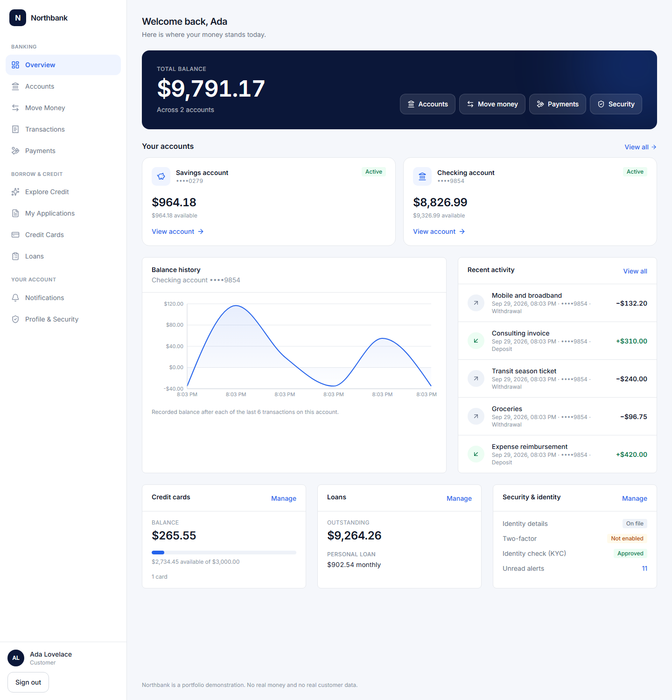
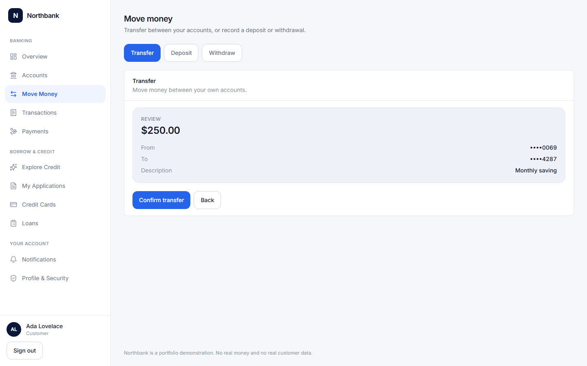
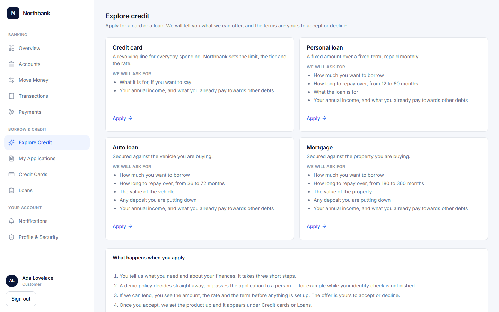
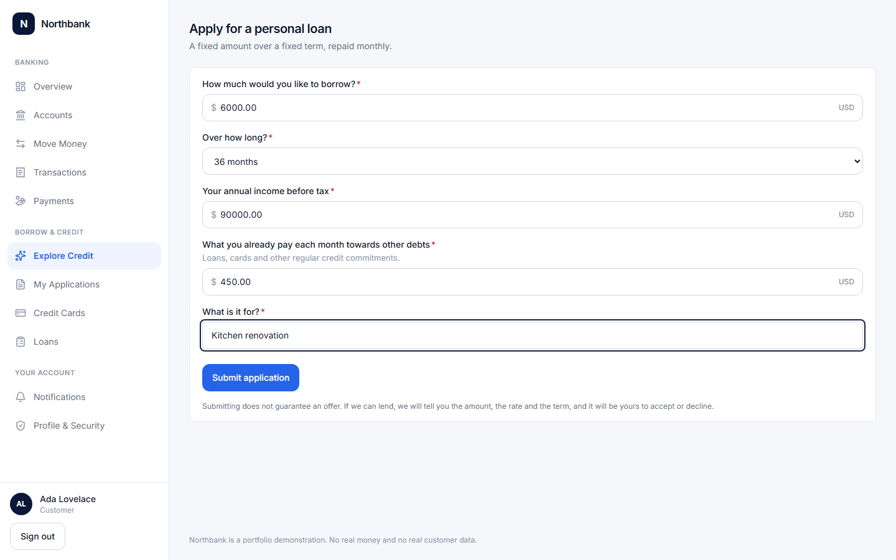
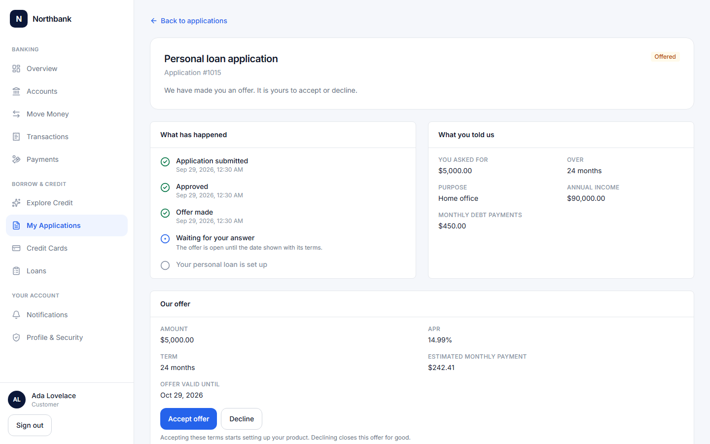
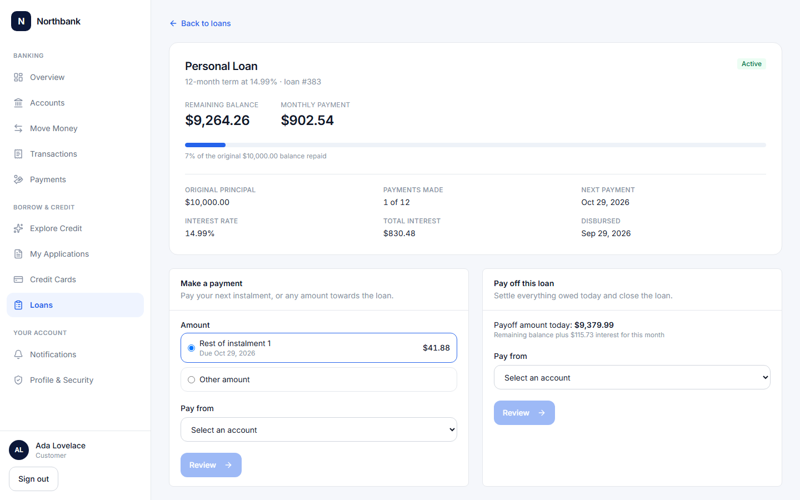
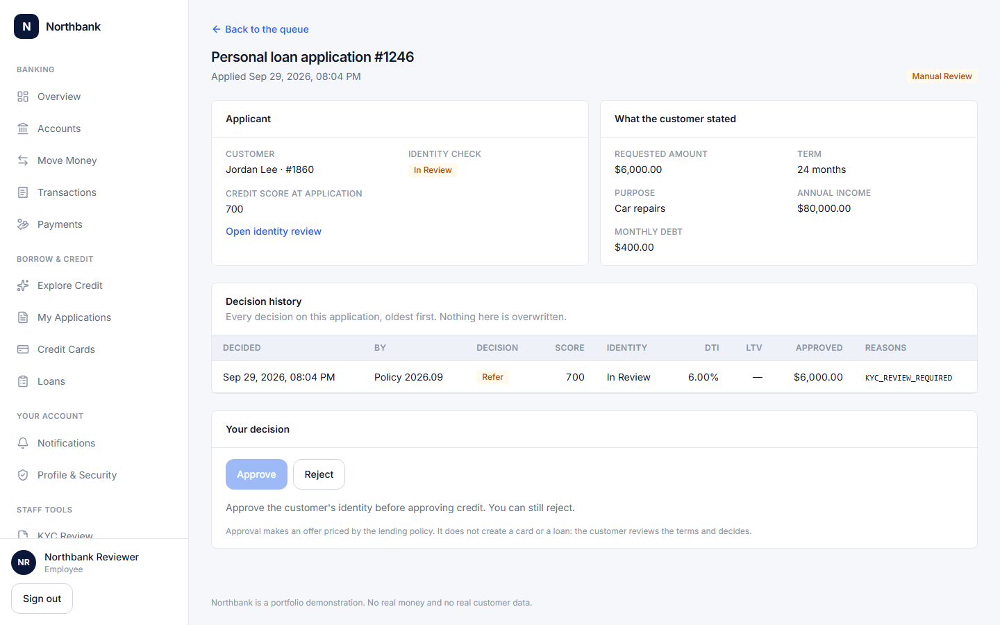
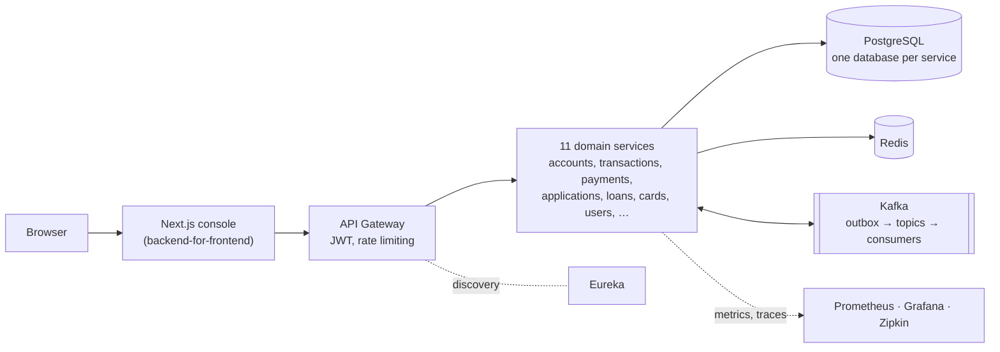

# Northbank Banking Platform

A full-stack, event-driven retail banking platform: Java 17 and Spring Boot
microservices, a Next.js customer and staff console, Kafka, PostgreSQL and Redis,
all running locally on Docker Compose.

[](https://github.com/Kalab21/banking-platform/actions/workflows/ci.yml)
[](https://github.com/Kalab21/banking-platform/actions/workflows/codeql.yml)
[](https://github.com/Kalab21/banking-platform/actions/workflows/security-scan.yml)

> A portfolio project built on synthetic data. It moves no real money and makes no
> production, regulatory or compliance claim.



## What Northbank demonstrates

- **Event-driven microservices**: 11 business services, each owning its own
  PostgreSQL database, behind an API gateway, with Kafka for derived state.
- **Correct money movement**: row locks on every balance change, idempotency keys
  on every money-moving request, and outcomes reported as unknown when the platform
  cannot know them.
- **A full lending lifecycle**: application, versioned underwriting, staff review,
  offer, customer decision, provisioning, and loan and card servicing.
- **Customer and staff authority**: ownership checked against stored records.
  Staff never take money out of a customer's account, never accept an offer on
  the customer's behalf, and never decide about themselves.
- **Reliable events**: a transactional outbox, retry with dead-letter topics, and
  idempotent consumers.
- **A full-stack console**: a Next.js backend-for-frontend for customers and staff.
  The browser never holds a bearer token.
- **Delivery**: Docker Compose for the whole stack, CI with CodeQL and Trivy, and
  Terraform for an AWS layout (not deployed).
- **Verification**: 1,482 automated tests in CI, plus live full-stack suites run
  against the real stack.

## Product experience

| Move money: review before confirming | Explore credit |
|---|---|
|  |  |

| Guided credit application | An application and its history |
|---|---|
|  |  |

| Paying a loan | Staff review of a referred application |
|---|---|
|  |  |

The full set is in [`docs/screenshots/`](docs/screenshots/).

## The credit journey

```text
Explore credit → Apply (3 steps) → Underwrite → Staff review if referred
      → Offer → Customer accepts or declines → Provision → Service the loan or card
```

- **Underwriting** is a deterministic, versioned policy: score, debt-to-income,
  loan-to-value, amount and term, and identity check. Each decision is stored as an
  immutable record with its reason codes.
- **An offer's terms are stored once.** The customer accepts exactly those terms.
  Only the applicant can accept or decline; staff and admins are refused.
- **Provisioning happens once.** The card or loan service creates the product from
  the accepted terms and confirms its real id. A redelivered event creates nothing
  new.
- **Servicing is in the console**: receive a loan, pay an instalment or any amount,
  pay the loan off, and pay a card.

## Architecture


```mermaid
flowchart LR
    Browser["Browser"] --> Console["Next.js console<br/>(backend-for-frontend)"]
    Console --> Gateway["API Gateway<br/>JWT, rate limiting"]
    Gateway --> Services["11 domain services<br/>accounts, transactions, payments,<br/>applications, loans, cards, users, …"]
    Services --> Postgres[("PostgreSQL<br/>one database per service")]
    Services --> Redis[("Redis")]
    Services <--> Kafka[["Kafka<br/>outbox → topics → consumers"]]
    Gateway -. discovery .- Eureka["Eureka"]
    Services -. metrics, traces .-> Obs["Prometheus · Grafana · Zipkin"]
```

- **Synchronous calls carry authoritative state.** A transfer must know whether its
  debit succeeded, so that is a Feign call.
- **Kafka carries derived state:** statistics, notifications, fraud scoring, and
  product issuance from accepted offers.
- **The browser never holds a bearer token.** The console calls the gateway from the
  server.

Service inventory, data ownership, event flows and design decisions are in
[docs/ARCHITECTURE.md](docs/ARCHITECTURE.md).

## Technology

| | |
|---|---|
| **Backend** | Java 17, Spring Boot 3.3, Spring Cloud Gateway, Eureka, OpenFeign, Resilience4j |
| **Frontend** | Next.js 16, React 19, TypeScript, Tailwind CSS 4 |
| **Data and messaging** | PostgreSQL 16 with Flyway, Redis 7, Apache Kafka |
| **Security** | JWT at the gateway, BCrypt, TOTP two-factor, per-resource ownership checks |
| **Observability** | Micrometer, Prometheus, Grafana, Zipkin, `X-Request-Id` correlation |
| **Testing and delivery** | JUnit 5, Testcontainers, Vitest, Playwright, GitHub Actions, CodeQL, Trivy, Terraform for AWS (not deployed) |

## Engineering highlights

- **`SELECT … FOR UPDATE`** on every balance change. Two concurrent debits are
  applied one after the other, and this is proven against a real PostgreSQL.
- **Idempotency keys** on deposits, withdrawals, transfers, payments, loan
  repayments and card payments. The key is minted when the customer reaches the
  review step and reused on every retry.
- **A transactional outbox** in every producer, so a committed change is never left
  unannounced. Consumers retry with backoff, send failures to a dead-letter topic,
  and discard duplicates.
- **Append-only decision evidence** for underwriting and review, and **stored offer
  terms** that the customer accepts as made.
- **Provisioning confirmation**: an application reads `PROVISIONED` only after the
  product service confirms a real product id.
- **Reconciliation**: a transfer that debited but failed to credit is recorded first,
  then reconciled leg by leg. Deciding who is made whole is left to a person.
- **Request ids and traces** that follow a request across every synchronous hop.

Architecture decisions and system trade-offs are documented in
[docs/ARCHITECTURE.md](docs/ARCHITECTURE.md), with security controls in
[docs/SECURITY.md](docs/SECURITY.md) and verification in
[docs/TESTING.md](docs/TESTING.md).

## Security

- The gateway validates the JWT and replaces any identity headers the client sent.
- Each service authorizes against the owner recorded with the resource, never
  against an id in the request.
- Money leaves an account only on its owner's instruction.
- Bank-controlled fields cannot be set by a customer: score, APR, limit, tier,
  approved amount and overdraft.
- Only the last four digits of an identity number are stored. Card numbers are
  masked, and full account numbers never reach the browser.

See [docs/SECURITY.md](docs/SECURITY.md) for the threat model, the full
authorization table and the dependency advisories.

## Testing

| Suite | Where it runs | Count |
|---|---|---:|
| Backend unit and web-slice | CI | 870 |
| Backend integration (Testcontainers, PostgreSQL, Redis, embedded Kafka) | CI | 158 |
| Frontend unit and component | CI | 385 |
| Playwright against a production build, no backend | CI | 69 |
| **Total in CI** | | **1,482** |
| Playwright against the full running stack | on demand | 46 |
| PowerShell full-stack suite (assertions) | on demand | 200 |

The live suites need all 13 backend processes running, so they are run on demand
rather than on every push. See [docs/TESTING.md](docs/TESTING.md).

## Known limitations

- A transfer between accounts is not globally atomic. Partial outcomes are
  reconciled and reported, not repaired automatically.
- Service-to-service calls rely on network isolation rather than mTLS.
- The wire, ACH and SWIFT rails are simulated: they are recorded, not settled.
- There is no credit bureau and no hosted production deployment.

The full list is in
[docs/ARCHITECTURE.md](docs/ARCHITECTURE.md#known-limitations).

## Run locally

Prerequisites: JDK 17+, Maven 3.8+, Docker Desktop.

```bash
git clone https://github.com/Kalab21/banking-platform.git
cd banking-platform
cp .env.example .env      # then set the values
mvn clean package         # build the service jars
docker compose up -d      # infrastructure, gateway, Eureka and 11 services
./scripts/seed-demo.sh    # optional: a synthetic customer; credentials are printed
```

| Endpoint | URL |
|---|---|
| **Banking console** | **<http://localhost:3000>** |
| API gateway | <http://localhost:8080> |
| Eureka dashboard | <http://localhost:8761> |
| Kafka UI | <http://localhost:8095> |

IDE-based setup, frontend-only development, the API reference and
troubleshooting are in [docs/DEVELOPMENT.md](docs/DEVELOPMENT.md).

## Documentation

| Document | What it covers |
|---|---|
| [Architecture](docs/ARCHITECTURE.md) | Topology, service boundaries, data ownership, design decisions |
| [Security](docs/SECURITY.md) | Threats, authentication, authorization, sensitive data, advisories |
| [Testing](docs/TESTING.md) | Strategy, suites, counts, commands |
| [Events](docs/EVENTS.md) | Kafka contracts, delivery, retry, dead-letter topics, idempotency |
| [Observability](docs/OBSERVABILITY.md) | Metrics, tracing, dashboards |
| [Development](docs/DEVELOPMENT.md) | Local setup, ports, commands, troubleshooting |

## Copyright & Usage

© 2026–present Kalabe Kebede. All Rights Reserved.

Northbank is proprietary portfolio software, published for recruitment, demonstration
and technical evaluation. It is not open source. No permission is granted to reuse,
modify, redistribute or commercially exploit its original material without written
permission. Third-party components remain under their own licences.

See [LICENSE](LICENSE) for the full terms.
