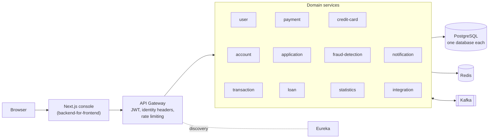

# Architecture

How Northbank is put together: what runs, what each part owns, how requests and
events move, and the design decisions behind it. Local setup is in
[DEVELOPMENT.md](DEVELOPMENT.md), and the security model is in
[SECURITY.md](SECURITY.md).

## Topology




There are 13 backend processes: Eureka, the API gateway and 11 business
services. The Next.js console runs as its own process.

- **Edge.** The Spring Cloud Gateway validates the JWT and derives the caller's
  identity from it. It injects `X-User-Id`, `X-Username` and `X-User-Role`
  downstream, replacing anything the client sent under those names, and removes
  them on public paths. It also applies a Redis token-bucket rate limit per
  client IP.
- **Discovery.** Eureka. The gateway routes by service name.
- **Business services.** Each owns its own schema in its own PostgreSQL database
  and reaches the others only through REST calls or events.
- **Messaging.** Kafka carries derived state: statistics, notifications, fraud
  scoring, card and loan issuance from accepted offers, and the confirmation
  that comes back.
- **Console.** Next.js App Router. React Server Components fetch and Server
  Actions mutate, so the browser never holds a bearer token.

The business services publish no host ports. Application traffic has to pass
the gateway, and that is what keeps the `/internal/**` endpoints internal.

## Service inventory and data ownership

| Process | Port | Database | Owns |
|---|---|---|---|
| `eureka-server` | 8761 | — | Service discovery |
| `api-gateway` | 8080 | — | Routing, JWT validation, rate limiting |
| `user-service` | 8081 | `user_db` | Users, sign-in and JWT issuing, 2FA, KYC documents and decisions, credit score |
| `application-service` | 8082 | `application_db` | Applications, underwriting decisions, offers, provisioning state |
| `account-service` | 8083 | `account_db` | Accounts, balances, overdraft |
| `transaction-service` | 8084 | `transaction_db` | Deposits, withdrawals, transfers, reconciliation |
| `payment-service` | 8085 | `payment_db` | Beneficiaries, payments, scheduled and recurring payments |
| `statistics-service` | 8086 | `statistics_db` | Aggregates built from events, cached in Redis |
| `notification-service` | 8087 | `notification_db` | Customer alerts built from events |
| `fraud-detection-service` | 8088 | `fraud_db` | Rules, Redis velocity counters, alerts, account freezes |
| `credit-card-service` | 8089 | `credit_card_db` | Cards, card transactions, interest, statements |
| `loan-service` | 8090 | `loan_db` | Loans, amortization schedules, repayments |
| `integration-service` | 8091 | `integration_db` | Simulated wire, ACH and SWIFT records, and FX |

Only `account-service` changes a balance. The other services move money by
calling it: synchronously through `transaction-service`, or through its
service-to-service `/internal` endpoints for loan and card servicing.

## How the main flows move

**Moving money** is synchronous. The console sends an idempotency key, and
`transaction-service` checks the source's ownership and the destination before
calling `account-service`. Each leg changes a balance under a row lock. The
events that follow (statistics, notifications, fraud scoring) are written to the
outbox in the same transaction and published afterwards.

**Credit** is a mix of both:

```text
Console ── POST /api/applications ──▶ application-service ── underwriting (versioned policy)
                                            │  APPROVE → offer (terms stored once)
                                            │  REFER   → staff review ── APPROVE → offer
                                            │  REJECT  → closed
Console ── accept (customer only) ─────────▶ application-service ── ApplicationApproved ──▶ Kafka
                                                                                           │
                                            loan-service / credit-card-service ◀───────────┘
                                            creates the product once, from the accepted terms
                                            ── LoanCreated / CreditCardCreated ──▶ application-service records the real id
```

**Scheduled payments** are claimed from the database with `SKIP LOCKED` and
executed as the customer who owns the paying account.

The event contracts, delivery guarantees and retry behaviour are in
[EVENTS.md](EVENTS.md).

## Authority boundaries

- **External request identity** is established by the gateway from the
  validated JWT. The gateway overwrites client-supplied `X-User-Id`,
  `X-Username` and `X-User-Role` headers before forwarding the request.
  Background work, such as a scheduled payment, establishes caller context from
  authoritative stored state (`CallerContext.runAs`), and service-to-service
  calls carry that identity on the Compose network. Those internal calls rely
  on network isolation rather than workload credentials or mTLS.
- **Ownership** is checked in each service against the owner stored with the
  resource (account, payment, loan, card, application), never against an id
  in the request.
- **Money out** of an account needs its owner's instruction. Staff may read,
  deposit, review and decide, but not debit a customer's account, accept an
  offer for them, or decide about their own records.
- **Bank-controlled fields** (score, APR, limit, approved amount, overdraft)
  are set by the platform, not accepted from a request.

The full table, principal by principal, is in [SECURITY.md](SECURITY.md).

## Observability

Every service exports Micrometer metrics to Prometheus, which a provisioned
Grafana dashboard reads, and sends traces to Zipkin. An `X-Request-Id` is minted
at the gateway and carried across every REST and Feign hop, so one request can
be followed through the synchronous path. Whether it survives the Kafka hops is not verified. The stack is optional
(`docker-compose.observability.yml`); details are in
[OBSERVABILITY.md](OBSERVABILITY.md).

## Infrastructure

Locally everything runs on Docker Compose: one PostgreSQL instance with a
database per service, Kafka, Redis, Eureka, the gateway, the 11 services and the
console, all from one shared non-root JRE image plus the console's own image.
`infrastructure/aws/` holds Terraform for an AWS layout (ECS Fargate, RDS, MSK,
ElastiCache, ALB, WAF, CloudFront). It is not deployed.

## Kafka topics

Nine topics: `user-events`, `account-events`, `application-events`,
`transaction-events`, `payment-events`, `credit-card-events`, `loan-events`,
`integration-events` and `fraud-alert-events`. Seven have both a
producer and a consumer; `integration-events` and `fraud-alert-events` are
published and not consumed by anything.

Events are explicit versioned types in `common-events`, shared by producer and
consumer, routed by an `eventType` field rather than a Java class name in a
Kafka header. [EVENTS.md](EVENTS.md) holds the full matrix: every topic, who
publishes it, who consumes it, which fields each consumer depends on, what is
deliberately absent, and which behaviour was removed because nothing produced
the event it waited for.

## Design decisions

**Database per service.** Each service owns its PostgreSQL database and reaches
others only through REST or events. This costs cross-service joins and gives up
distributed ACID, in exchange for services that deploy and migrate independently.

**The frontend is a backend-for-frontend, not a browser client.** Every call to the
banking API is made by the Next.js server. The JWT lives in an httpOnly cookie the
browser cannot read, and the gateway needs no CORS policy because no cross-origin
request is made. The cost is that the console requires a Node process rather than
a static bundle.

**Flyway with `ddl-auto: validate`.** Schema changes are explicit, versioned SQL.
Hibernate verifies the schema at boot but never changes it.

**An idempotency key on every money-movement request.** `POST /api/transactions/deposit`,
`/withdraw` and `/transfer`, `POST /api/payments`, loan repayment and payoff, and card
payment, cash advance and purchase require an `Idempotency-Key` header: an opaque,
client-generated value naming one logical operation. It is deliberately not
derived from the amount, the accounts or the time, because two genuinely
identical transfers a minute apart must both be able to succeed.

`transaction-service` records each key in `idempotency_record` under a unique
constraint, alongside a SHA-256 fingerprint of the caller and the normalised
request. The constraint is the mechanism: two concurrent duplicates both attempt
the insert, the database admits one, and the loser resolves against the winner's
row instead of calling `account-service` a second time.

| Situation | Response |
|---|---|
| Missing or malformed key | `400`, nothing executed |
| Same key, same request, first attempt succeeded | the stored response, with `Idempotent-Replay: true` |
| Same key, different request | `409`, nothing executed |
| Same key, first attempt still running | waits briefly for the result, then `409` with `Retry-After` |
| Same key, first attempt refused with nothing applied | executed again — see below |
| Same key, first attempt's outcome unknown | `504`, and never re-executed |

The last two rows are the interesting ones. A refusal that provably moved no
money — a validation error, insufficient funds, a frozen account, an open
circuit that stopped the call leaving this service — releases the key, because
caching a rejection would lock the client out of an operation it is entitled to
retry. A failure that reached `account-service` and then lost the thread — a
timeout, a 5xx, a transfer whose debit landed and whose credit did not — spends
the key permanently. Whether the balance changed is not knowable from
`transaction-service`, and a retry would be a coin-flip between a no-op and a
second debit. Those records are left unknown rather than resolved automatically;
for transfers, `TransferReconciler` later establishes from `account-service` what
each leg actually did and records it, without moving money.

This is also why the circuit breaker still has no retry. Idempotency makes a
*client's* repeat safe; it does not make an automatic in-process retry of a
half-completed downstream mutation safe, and nothing here changed that.

**How the console holds up its end.** The key is only worth anything if the
client reuses it, and at first the console did not: it minted one inside each
server action, on every invocation, so every resubmission was a different
logical operation and the table above never applied. The browser now mints one
opaque id when the customer reaches the review step and sends it with every
attempt at that same payment. A refusal that moved nothing keeps the key, so a
retry is the same operation. Only starting a new payment mints a new one.

The console also reads the outcome column rather than flattening it. 503 is the
only server status it treats as a definite "nothing happened", because that is
the only one the backend promises: the circuit was open and the call never left
`transaction-service`. 504 and a bare 500 are treated as unknown, as is a
transport failure, where the answer may be the thing that was lost. For an
unknown outcome the console claims neither result, offers no control that would
resend, and points the customer at their transaction history.

**A pessimistic row lock on every balance change.** `updateBalance`,
`updateStatus` and `updateOverdraftLimit` load the account through
`findByIdForUpdate`, which issues `SELECT ... FOR UPDATE`. Reading the balance,
deciding whether it is sufficient and writing the new figure all happen with the
row locked, so two concurrent debits are applied one after the other rather than
both against the same starting balance.

Pessimistic rather than optimistic. `@Version` would also prevent the lost
update, but by failing the loser with an exception that then has to be caught,
re-read and replayed — and the replay has to re-run the overdraft rules, because
the answer depends on the balance it now sees. A row lock gives the same
correctness by making the second transaction wait, with no retry loop and no
path where a debit is silently attempted twice. Contention on one account is
low; this is a customer's chequing account, not a global counter.

Locking is per account. Nothing in `account-service` holds two account locks at
once, so there is no lock-ordering deadlock to design around: a transfer takes
its two locks in two separate requests, in two separate transactions.

The lock is held for the duration of the transaction, which includes the Kafka
publish. `max.block.ms` is pinned to 1000 ms, so a broker outage extends the
hold by at most a second rather than indefinitely.

**A transfer is still not atomic across services.** The debit and the credit are
two calls to `account-service`, which owns its own database. `@Transactional` on
the transfer method covers this service's rows and nothing else. If the credit
fails after the debit has been applied, the transfer is reported as
`500 — needs reconciliation` rather than as the credit leg's own error, and the
idempotency record settles as unknown so no retry can debit the source twice.
There is no saga and no compensating transaction. The transactional outbox makes
event publication atomic with each service's own write, but it does not span the
two legs; the transfer reconciler reports what happened to each leg and leaves any
correction to a person.

**Events for derived state, synchronous calls for authoritative state.** A transfer
must know immediately whether the debit succeeded, so that is a Feign call.
Statistics, notifications and fraud scoring tolerate lag, so they consume Kafka.
This keeps the critical path short and prevents a notification outage from blocking
money movement.

**JWT validated once, at the gateway.** Downstream services consume `X-User-Id` /
`X-User-Role` rather than re-parsing the token. The gateway overwrites those
headers on every routed request, and the services are not reachable from outside
the Compose network, which is what makes consuming them safe. Services still apply
their own ownership and role checks; the headers establish *who* is calling, not
*what* they may do. `user-service` runs its own filter because it issues the
tokens. See [SECURITY.md](SECURITY.md).

**Fast-failing Kafka producers.** `max.block.ms` is pinned to 1000 ms. The
60-second default blocks request threads during a broker outage until the service
appears hung.

**Audit log written inside the domain transaction.** In `account-service`,
`application-service`, `payment-service` and `transaction-service`, each state change
writes an `audit_log` row in the same `@Transactional` unit as the business write,
attributed to the caller the gateway identified (or `SYSTEM` for scheduled work).
`loan-service`, `credit-card-service` and `user-service` have the table but do not yet
write to it.

## Engineering tradeoffs

### Distributed transfer consistency

Account-to-account transfers cross a service boundary rather than using a distributed
transaction. Partial or uncertain outcomes are surfaced as unknown and require
reconciliation rather than an unsafe automatic retry.

Publishing is no longer part of that problem. Every producer on the platform writes
its event to a transactional outbox in the same transaction as the change, and a
relay sends it afterwards, so a committed change cannot go unannounced.

A transfer that debits one account and fails to credit the other is now recorded
before it starts, in a transaction of its own, so the evidence survives the
rollback. A reconciler asks account-service what became of each leg — the legs
are keyed, so the answer is knowable rather than inferred — and records it. It
deliberately stops there: which account to make whole is a decision about
someone's money, and the platform does not make it automatically.

### Service-to-service identity

Internal calls rely on isolation inside the local Compose network. A shared production
cluster would require workload identity, signed service credentials or mTLS rather than
network placement alone.

### External financial rails

Wire, ACH and SWIFT integrations are simulated adapters. The project demonstrates
contracts, persistence and failure handling without connecting to real financial networks
or moving real money: an external transfer is recorded, not settled, and no account balance
changes because of one. Money leaves an account through transactions, payments, loan
repayments and card payments, which do debit it.

### Deployment and platform versions

The stack runs and is tested on Docker Compose. `infrastructure/aws/` holds Terraform
definitions for an AWS layout (ECS Fargate, RDS, MSK, ElastiCache, ALB, WAF, CloudFront);
no hosted instance is published. The services are on Spring Boot 3.3 and Spring Cloud
2023.0; moving to the current release train is a coordinated upgrade tracked in
[SECURITY.md](SECURITY.md#deferred-platform-modernization) rather than a dependency
bump.

## Known limitations

These are recorded rather than solved, and each is a deliberate stopping point.

1. **A transfer is not atomic across services.** The debit and the credit are
   two calls to `account-service`. If the credit fails after the debit is
   applied, the idempotency record settles unknown so no retry can debit twice.
   There is no saga and no compensating transaction.
2. **Reconciliation reports; it does not repair.** Each transfer attempt is
   recorded before its legs run. `TransferReconciliationJob` asks
   `account-service` every five minutes what became of each keyed leg of a
   stuck attempt and records the answer; an `/internal` endpoint, reachable
   only inside the Compose network, runs the same pass on demand. Nothing then credits or
   reverses money on its own: deciding which account is made whole is left to a
   person. Unknown idempotency outcomes outside transfers are surfaced only as
   the `banking.idempotency.unknown` gauge.
3. **Dead-letter topics are written, not replayed.** Consumers retry with
   bounded exponential backoff, then publish the record to `<topic>.DLT` with
   its failure headers and move on; deserialization failures go straight
   there. Nothing consumes the dead-letter topics, so replay is a manual step.
4. **Service-to-service calls are not authenticated.** The `/internal`
   endpoints rely on network isolation — no host ports, no gateway route —
   rather than mTLS or a service credential.
5. **Circuit-breaker coverage is partial.** Only the
   `transaction-service` → `account-service` hop is protected.
6. **Observability stops short of operations.** No log aggregator, traces held
   in memory and lost on restart, no alerting rules and no route for one to
   fire down.
7. **External rails are simulated.** Wire, ACH and SWIFT requests are
   validated, owner-checked and recorded, but not connected to anything, and
   they debit no balance.
8. **Test depth is uneven.** Account, transaction, payment, application,
   credit-card, loan and user services and the shared Kafka and idempotency
   modules have Testcontainers suites; `notification`, `integration`, `fraud`
   and `statistics` are covered by authorization, contract and unit tests only.
9. **The live suite runs on demand.** Starting thirteen backend processes on
   every push is not a sensible trade, so only the offline suite is wired into
   CI.
10. **Audit coverage is partial.** Account, application, payment and transaction
    services write an attributed audit row with each change; loan, credit-card
    and user services do not yet, so repayments, card payments and KYC reviews
    are traceable through their own records and events rather than the audit log.
11. **Second factor is opt-in, including for staff.** Requiring it for
    employees needs a first-enrolment flow that does not exist yet, because
    enrolment itself requires a signed-in caller.
12. **A monthly recurring payment can drift to the 28th.** Each occurrence is
    dated from the previous one's due date, so a series that starts on the
    29th, 30th or 31st settles on the 28th after February. Loan instalments are
    dated from the loan's start and do not drift; doing the same for payments
    needs the series' first date stored, which is a schema change.
13. **A remote debit is not compensated if the local commit fails.** A loan
    repayment, a card payment and an immediate payment debit the account in
    `account-service`, then commit their own record. If that local commit
    fails, the money has moved and the product has not recorded it; the
    idempotency key settles unknown, so a retry cannot debit twice, and
    repairing the record is left to a person.
14. **An unconfirmed scheduled payment stays failed.** When the executor cannot
    tell whether a scheduled payment's debit happened, the payment is marked
    failed with "Outcome unconfirmed; check the account before paying again",
    and a recurring series does not advance. A payment the bank declined does
    advance it.
15. **External rails have no idempotency key or balance check.** A wire, ACH
    or SWIFT request is a record only (item 7), so a retried request is
    recorded twice and no balance is checked, because nothing is settled.
16. **Some lifecycle edges are displayed, not stored.** An offer that expires
    leaves its application `OFFERED`; the console shows it as lapsed and
    acceptance is refused. Cancelling an offered application leaves the offer
    row `OFFERED`, and acceptance is refused by the application's own
    transitions. A KYC document decision can be revised by another reviewer;
    there is no separate document state machine.
17. **Single-currency accounts, and no card funding link.** Every account
    holds one currency and nothing converts; a request in another currency is
    refused. A card has no linked funding account (`linkedAccountId` is empty),
    so each card payment names the account it is paid from.
18. **Staff can act as the bank's desk.** An employee can deposit to a
    customer's account, add a payee, submit an application on a customer's
    behalf and record a simulated card purchase. These are assisted-service
    and simulation actions. Staff still cannot move a customer's money out,
    accept an offer for them, or decide about themselves.
19. **An account's history shows its own transactions only.** Deposits,
    withdrawals, transfers and payments are recorded by `transaction-service`
    and appear in the account's history and balance chart. A loan
    disbursement, a loan repayment and a card payment change the balance
    through `account-service` directly and are recorded on the loan or card,
    so the account's history omits them and its chart can differ from the
    current balance, which is always correct. A single cross-product ledger
    view is future work.

## Repository structure

```
banking-platform/
├── pom.xml                           # Maven parent - dependency and version management
├── docker-compose.yml                # Full stack: infrastructure + all 13 backend processes
├── docker-compose.infra.yml          # Infrastructure only, for IDE-based development
├── docker-compose.observability.yml  # Prometheus, Grafana, Zipkin (optional)
├── Dockerfile                        # Shared JRE 17 Alpine image, non-root
├── e2e-tests.ps1                     # End-to-end suite against the running stack
├── .env.example                      # Environment template - no real credentials
│
├── frontend/                    # Next.js banking console (App Router, TypeScript)
│   ├── src/app/(auth)/          #   login, register
│   ├── src/app/(app)/           #   authenticated shell incl. /admin
│   ├── src/features/            #   server actions + client components per domain
│   ├── src/lib/api/             #   the only outbound HTTP layer (gateway only)
│   └── Dockerfile               #   standalone production image, non-root
│
├── observability/               # Telemetry configuration, provisioned on startup
├── common-events/               # Versioned event types shared by producers and consumers
├── common-kafka/                # Outbox relay, retry and dead-letter wiring, duplicate guard
├── common-idempotency/          # Idempotency keys and outcome classification
├── common-observability/        # Shared X-Request-Id filter and Feign interceptor
├── common-security/             # Caller identity, access guard, denial handling
├── eureka-server/               # Service discovery
├── api-gateway/                 # Edge: routing, JWT filter, rate limiting
├── user-service/                # Auth, JWT, 2FA, KYC, credit score
├── application-service/         # Product application workflow
├── account-service/             # Accounts, balances, overdraft
├── transaction-service/         # Deposits, withdrawals, transfers
├── payment-service/             # Beneficiaries, payments, recurring
├── credit-card-service/         # Cards, interest, statements, rewards
├── loan-service/                # Amortization, disbursement, repayment
├── statistics-service/          # Kafka-fed aggregates, Redis cached
├── notification-service/        # Kafka-fed customer alerts
├── fraud-detection-service/     # Rules engine, Redis velocity, freeze
├── integration-service/         # Wire/ACH/SWIFT stubs, FX
│
├── docs/                        # Architecture, security, testing, events, observability, development
├── docker/postgres/init-db.sql  # Creates one database per service
├── .github/workflows/           # CI, CodeQL, security scan
├── scripts/seed-demo.sh         # Seeds a synthetic demo customer
└── infrastructure/aws/          # Terraform: ECS, RDS, MSK, ElastiCache, ALB, WAF, Route 53
```

Each service follows the same layered package layout: `controller`, `service` plus `impl`,
`repository`, `model`, `dto`, `mapper`, `kafka`, `config`, `exception`.
